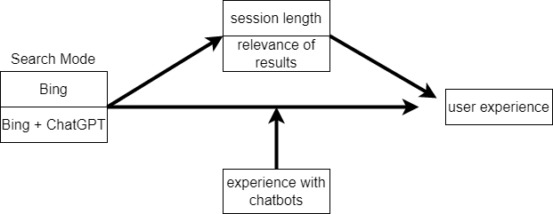
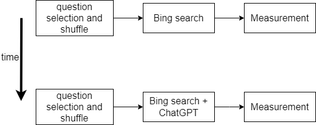
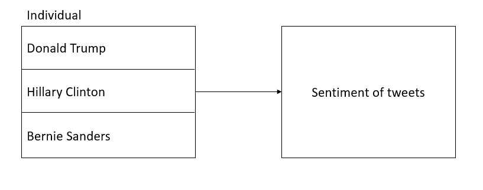

```{r setup, include=FALSE}
knitr::opts_chunk$set(warning = FALSE, error = FALSE, message = FALSE)
```

\tableofcontents

# Part 1 - Design and set-up of true experiment

## The motivation for the planned research
During this century we have seen the rise of powerful search engines, which are able to quickly provide you with links to the data you are trying to find. A recent development in this field is the introduction of large language models (LLMs). These LLMs have the capability to present the search results in a more natural and human-friendly way. The hype around these models has led large search engines to quickly incorporate these LLMs in their products. An example is Bing, which has incorporated a version of chatGPT into their search browser. The question that remains is if this integration actually leads to an increase in perceived user experience or if the enthusiasm is purely based on the current hype. By conducting the experiments described below, the goal is to find out if the chatGPT integration in the Bing search engine improves the user experience.

## The theory underlying the research

Chat-bots have been successful as interactive information retrieval tools (Tariverdiyeva, Gunay. "Chatbots' Perceived Usability in Information Retrieval Tasks: An Exploratory Analysis." 2019).

New large language models fall under the chatbot category but it is still unclear whether they offer an advantage when it comes to user experience when viewed as information retrieval systems.

In information retrieval many measures have been proposed as proxy variables to measure user experience (Dalrymple, Prudence Ward, and Douglas L. Zweizig. "Users' Experience of Information Retrieval Systems: An Exploration of the Relationship between Search Experience and Affective Measures." Library and Information Science Research 14.2 (1992): 167-81).

More specifically, session duration has been a very popular measure for evaluating interactive information retrieval systems (Kelly, Diane. "Methods for evaluating interactive information retrieval systems with users." Foundations and Trends® in Information Retrieval 3.1--2 (2009): 1-224.)

## Research questions

Does the integration of chatGPT into the Bing search engine lead to an increase in user experience over the Bing search engine without this integration?

## The related conceptual model

<ul>
  <li>Independent variable: Search Mode (Bing, Bing + ChatGPT)</li>
  <li>Dependent variable: User experience</li>
  <li>Mediating variable: Session length, relevance of results</li>
  <li>Moderating variable: Experience with chatbots</li>
</ul>

## Experimental Design

Hypothesis: the integration of chatGPT has a positive effect on user experience during search.

Design: we use a within-subject experiment. All the participants both evaluate the standard search engine and the search engine with chatGPT integration. Because we only have one group, random allocation is not an issue. First each participant gets a set of questions to which they should find the answer using the regular Bing search engine. Then, the user experience is evaluated using a questionnaire. Afterwards, the participant is again presented with a new set of questions to which they should find the answers using the search engine with the chatGPT integration. The user experience is again evaluated using a questionnaire. To make sure that the type of questions are equally hard between the two search experiments, we randomly select half of the total number of questions for each of the experiments.

## Experimental procedure


A room is prepared with a laptop with two search engines in it: search engine 1 is a standard version of Bing, search engine 2 is Bing with Chat-GPT integration. Each participant is called into the room and is given a set of questions to answer using the first search engine. Afterwards, the user is given a questionnaire, containing statements aimed at evaluating the user experience of the search engine. Then, the participant is given a new set of questions and they use the Bing with Chat-GPT engine, after which they are given the same questionnaire again. We use random question allocation for the two search engines to decrease the effect of the order of questions on the experiment.

## Measures

We use a questionnaire to give us an indication of the perceived user experience of the participants for both the normal search engine and the chatGPT integrated search engine. The questionnaire consists of a list of statements, where the participants have to fill in whether they agree with a certain statement (e.g. "The results of the search engine were provided to me in an intuitive way."). The focus of this questionnaire is on the overall user satisfaction, not whether the search engine could correctly answer the questions. The answers are based on an interval Likert-scale from 1 to 7. Where a higher number corresponds to a higher agreement with the statement. The answers to the statements are collected and can be compared between the two experiment rounds (with and without chatGPT). The Likert-scale answers allow us to make a clear numerical comparisons between answers. So finally the measures are the differences in agreement to the same statements in the two questionnaires.

## Participants

We want to find a group of participants in Delft as diverse as possible, because we want to find the general user experience improvement. If we only take a subsample of the population, like elderly people or students, we do not get a very general idea and loose external validity. We need 119 people, because we use a Likert scale using intervals. This provides us with a 95% confidence interval. We find participants by calling people in Delft and asking if they want to participate in our experiment, after which the experiment is conducted at a later moment in time. This way we hope to get a random sample from the whole population in Delft.

## Suggested statistical analyses

We want to find the difference between the user experience of the two search engines to see if it has increased. This means that the results of the two experiments have to be paired with each other. The results of the two experiments are dependent, because a participant might in general already give higher ratings. So this means that with our interval questions, we could use a paired sample t-test or repeated measure ANOVA.

# Part 2 - Generalized linear models

## Question 1 Twitter sentiment analysis (Between groups - single factor)

### Conceptual model



### Model description

The model that we fit on the data is a normal distribution where the mean is dependent on the individual that tweeted the tweet. This way a new mean is created for each individual. So we have the following equations:

$score \sim dnorm(mu, sigma)$

$mu <- a[Candidate]$

$a[Candidate] \sim dnorm(0, 10)$

$sigma \sim dunif(0.001, 20)$

The priors defined here are loosely based on the visual inspection of the data, which is given below. In these graphs we can see that the sentiment of the tweets for each individual are centered around 0. So we take a distribution for the mean of our model that also has a mean of 0, but we add a standard deviation of 10 to be sure that the actual mean is found. For the sigma of our model, we also choose quite an uninformed prior. From the visual inspection it seems that the data has a standard deviation of at most 5, but to be sure that it is contained within our prior, we extend it to 20.

### Generate Synthetic data

```{r, echo=FALSE, message=FALSE, warning=FALSE, include=FALSE}
library(twitteR)
#install.packages("RCurl", dependencies = T)
library(RCurl)
#install.packages("bitops", dependencies = T)
library(bitops)
#install.packages("plyr", dependencies = T)
library(plyr)
#install.packages('stringr', dependencies = T)
library(stringr)
#install.packages("NLP", dependencies = T)
library(NLP)
#install.packages("tm", dependencies = T)
library(tm)
#install.packages("wordcloud", dependencies=T)
#install.packages("RColorBrewer", dependencies=TRUE)
library(RColorBrewer)
library(wordcloud)
#install.packages("reshape", dependencies=T)
library(reshape)
```

Below, the code is given for the creation of the synthetic data. We pick three normal distributions, where each distribution has a different mean, but the same standard deviation (sd=2). The three distributions have a mean of -5, 0 and 5 for T, C and B, respectively.

```{r echo = T}
# Synthesis of a test data set.
sequence <- seq(-10, 10, by = .1)
test_T = rnorm(sequence, mean=-5, sd=2)
test_C = rnorm(sequence, mean=0, sd=2)
test_B = rnorm(sequence, mean=5, sd=2)

setwd('C:/Users/Rens/DS_group/A')

sem_test<-data.frame(test_T, test_C, test_B)

semFrameTest <-melt(sem_test, measured=c(test_T, test_C, test_B))
names(semFrameTest) <- c("Candidate", "score")
semFrameTest$Candidate <-factor(semFrameTest$Candidate, labels=c("Donald Trump",
                                        "Hillary Clinton", "Bernie Sanders"))
```


```{r, echo=FALSE, message=FALSE, warning=FALSE}

######################## Sentiment analysis
### Collecting tweets, and data preparation

# Include the annotated R script (excluding your personal Keys and Access Tokens information), but put echo=FALSE, so code is not included in the output pdf file.

tweets_T <- scan('data/tweets_T.txt', what = 'character', comment.char=';', 
                 sep="\n")

tweets_C <- scan('data/tweets_C.txt', what = 'character', comment.char=';', 
                 sep="\n")

tweets_B <- scan('data/tweets_B.txt', what = 'character', comment.char=';', 
                 sep="\n")

#tweets_T.text <- laply(test, function(t)t$getText()) #get text out of tweets
#tweets_C.text <- laply(tweets_C, function(t)t$getText())#get text out of tweets
#tweets_B.text <- laply(tweets_B, function(t)t$getText())#get text out of tweets


#taken from https://github.com/mjhea0/twitter-sentiment-analysis
#read the positive words
pos <- scan('data/positive-words.txt', what = 'character', comment.char=';') 

#read the negative words
neg <- scan('data/negative-words.txt', what = 'character', comment.char=';') 

source("sentiment3.R") #load algorithm
# see sentiment3.R form more information about sentiment analysis. 
# It assigns a integer score
# by subtracting the number of occurrence of negative words from that 
# of positive words

analysis_T <- score.sentiment(tweets_T, pos, neg)
analysis_C <- score.sentiment(tweets_C, pos, neg)
analysis_B <- score.sentiment(tweets_B, pos, neg)


sem<-data.frame(analysis_T$score, analysis_C$score, analysis_B$score)


semFrame <-melt(sem, measured=c(analysis_T.score,analysis_C.score, 
                                analysis_B.score ))

names(semFrame) <- c("Candidate", "score")

# change the labels for your individual/organisation
semFrame$Candidate <-factor(semFrame$Candidate, 
                  labels=c("Donald Trump", "Hillary Clinton", "Bernie Sanders")) 

#The data you need for the analyses can be found in semFrame

```

### Visual inspection Mean and distribution sentiments
To get an idea of the distributions of the data, we make some graphs. First, we plot the data distributions of the tweet sentiment per individual. This graph shows that the distributions seem similar, all with a mean around 0. However, for the Trump data, there seem to be more more values with a higher sentiment. If we look at the boxplots, we see that Trump seems to have the most positive sentiment, but he also has more extreme maxima. Hillary seems to be a bit less positive than Bernie.

```{r echo = T}
#include your analysis code and output in the document
trump_inspect = subset(semFrame, (Candidate == "Donald Trump"), 
                       select=c(score))

hillary_inspect = subset(semFrame, (Candidate == "Hillary Clinton"), 
                         select=c(score))

bernie_inspect = subset(semFrame, (Candidate == "Bernie Sanders"), 
                        select=c(score))

library(sm)
sm.density.compare(semFrame$score, semFrame$Candidate, xlab = "sentiment score")
title(main="Sentiment per individual")
legend('topright', legend=levels(semFrame$Candidate), 
       col=c('red', 'blue', 'green'), lty=1:2, cex=0.8,
       title="Individual", text.font=4, bg='lightblue')

boxplot(semFrame$score ~ semFrame$Candidate, data=semFrame, main="Sentiment",
xlab="Individual", ylab="Sentiment")
```

### Frequentist approach

#### Analysis verification

If we input the synthetic data into the model, we see that the individuals are indeed significant for the sentiment we get out of the tweet (F(2,600)=1204, p < 0.001). This is what we expected, since this is how we created the data. A summary of the model reveals that the means of the groups in the model are indeed the means that we set for the distribution. This can be seen in the summary code section below. The synthetic Trump data has an estimate around -5, Hillary close to 0 and Bernie close to 5. These are exactly the parameters that we gave the synthetic data. The p-value is lower than 0.05, which shows us that the individuals have a significant effect on the resulting sentiment. The F-value of 1204 shows us that the variation between sample means is way larger than the variance within samples. This again shows that there is a big difference between the individuals. Finally, the AIC value comparison shows that model1 has a better fit of the data than model0, since its AIC value is lower.

```{r echo = T}
#include your analysis code of synthetic data and output in the document

# model without predictor
model0 <- lm(semFrameTest$score ~ 1, data = semFrameTest)

# model with predictor
model1 <- lm(semFrameTest$score ~ semFrameTest$Candidate, data = semFrameTest) 
anova(model0, model1)
summary(model1)

AIC(model0, model1)
```

#### Linear model {#linear-model}

If we input the actual data into the model, we see that the individuals are indeed significant for the sentiment we get out of the tweet. This can be concluded by looking at the p and F-value. The p-value is lower than 0.05, which shows us that the individuals have a significant effect on the resulting sentiment. The F-value of 13.478 shows us that the variation between sample means is way larger than the variance within samples. This again shows that there is a difference between the individuals, regarding tweet sentiment. The AIC values show us that model1 has a better fit, since its its AIC value is lower than model0.

```{r echo = T}
#include your analysis code and output in the document

# model without predictor
model0 <- lm(semFrame$score ~ 1, data = semFrame)

# model with predictor
model1 <- lm(semFrame$score ~ semFrame$Candidate, data = semFrame)

anova(model0, model1)
summary(model1)

AIC(model0, model1)
```

#### Post Hoc analysis

If we conduct a bonferroni post hoc analysis, we see that even with adjusted p-values Donald Trump has a significant difference with both Hillary and Bernie, regarding tweet sentiment. However, we also see that the tweet sentiment difference of Bernie and Hillary is not significant with the adjusted p-value.

The linear model assumes normality for the distribution of the residuals. Therefore, we do a shapiro test to see if this assumption can be made. The result of this test gives an indication that this assumption might be violated (p < 0.05).

The results of the Levene test show that the homogeneity of the variances assumption is also violated (p < 0.05).

So the post-hoc analysis shows that our assumptions of the data could not be made and that non-parametric tests should be used to analyse the data.

```{r echo = T}
#include your code and output in the document
pairwise.t.test(semFrame$score, semFrame$Candidate,
paired = FALSE, p.adjust.method = "bonferroni")

library(car)
shapiro.test(resid(model1))
leveneTest(semFrame$score, semFrame$Candidate)
```

#### Report section for a scientific publication

The analysis focuses on the effect of an individual on the sentiment of their tweets. In the experiment, two models are created. The first model only has an intercept and no additional information about the individual that tweeted the tweet. The second model does take this information into account. The experiment has shown that the addition of data about the individual significantly improves the model (F(2,297)=13.478, Pr(\>F)\<0.001).

Moreover, a post-hoc analysis of the experiment was conducted. This showed that the sentiment differences between Donald Trump and Hillary Clinton (p\<0.001) and Bernie Sanders (p\<0.001) were significant. However, the sentiment difference between Hillary and Bernie (p=1) was not significant. The post-hoc analysis also showed that the model assumptions regarding normality and equal variances could not be made, thus showing that additional non-parametric tests are needed to analyse the results.

### Bayesian Approach

#### Analysis verification

We fit two models, a model with only an intercept and a model with the relation between sentiment and individual added. The second model has a better fit, since its WAIC value is lower than the model without the additional relation.

We can see that the means of the synthetic data are correctly reproduced by the second model. a[1], a[2] and a[3] correspond to the synthetic Trump, Hillary and Bernie data, respectively. Also the sigma of 1.93 is almost a precise reproduction of the actual standard deviation of 2. For a[1], a[2] and a[3] the 95% credible intervals are [-5.19,-4.64], [-0.17,0.37] and [4.62,5.17], respectively.

The WAIC values show that m1 has a better fit, since its WAIC value is lower than model0.

```{r, echo=FALSE}
library(rethinking)
```

```{r, echo=FALSE, results='hide', warning=FALSE, error=FALSE}
#include your analysis code of synthetic data and output in the document
set.seed(1)
da <- subset(semFrameTest, select = c(score, Candidate))
m0 <-map2stan(
  alist(
    score ~ dnorm(mu, sigma),
    mu <- a,
    a ~ dnorm(0, 10),
    sigma ~ dunif(0.001, 20)
  ), data = da, iter = 1000, chains = 4, cores = 4
)
m1 <-map2stan(
  alist(
    score ~ dnorm(mu, sigma),
    mu <- a[Candidate] ,
    a[Candidate] ~ dnorm(0, 10),
    sigma ~ dunif(0.001, 20)
  ), data = da, iter = 1000, chains = 4, cores = 4
)
```

```{r, echo=FALSE}
precis(m1, depth = 2, prob = .95, pars=c('a','sigma'))
compare(m0, m1)
```

#### Model comparison

Again we make two models, one with only intercept and one with an additional relation to the individual. The WAIC shows that the model with the additional relation is better than the model with only intercept. The 95% credible intervals are [0.74,1.35] for Trump, [-0.32,0.27] for Hillary and [-0.13,0.48] for Bernie. It shows that there is no overlap between Trump and any other in the credible intervals, but there is some overlap between Hillary and Bernie.

The WAIC values show that m1 has a better fit, since its WAIC value is lower than model0.

```{r echo = T, results = 'hide'}
#include your code and output in the document
set.seed(1)
dat <- subset(semFrame, select = c(score, Candidate))
m0 <-map2stan(
  alist(
    score ~ dnorm(mu, sigma),
    mu <- a ,
    a ~ dnorm(0, 10),
    sigma ~ dunif(0.001, 20)
  ), data = dat, iter = 1000, chains = 4, cores = 4
)
m1 <-map2stan(
  alist(
    score ~ dnorm(mu, sigma),
    mu <- a[Candidate] ,
    a[Candidate] ~ dnorm(0, 10),
    sigma ~ dunif(0.001, 20)
  ), data = dat, iter = 1000, chains = 4, cores = 4
)
```

```{r echo = T}
precis(m1, depth = 2, prob = .95, pars=c('a','sigma'))
compare(m0, m1)
```

#### Comparison individual/organisation pair

We compare the three possible pairs, and we see basically the same results as in the frequentist approach. The 95% credible intervals with Trump both do not include 0, which makes it likely that the tweet sentiments of the others are not equal to those of Trump. We can also see that the 95% credible interval of Hillary and Bernie does contain 0, which still maintains a significant possibility that there is not a difference in tweet sentiments between these two individuals.

```{r echo = T}
#include your code and output in the document
post <- extract.samples(m1, n=1e5)
diffhill_trump <- post$a[,1] - post$a[,2]
diffhill_bernie <- post$a[,2] - post$a[,3]
difftrump_bernie <- post$a[,1] - post$a[,3]
PI(diffhill_trump, prob = 0.95 )
PI(diffhill_bernie, prob = 0.95 )
PI(difftrump_bernie, prob = 0.95 )
```

## Question 2 - Website visits (between groups - Two factors)

### Conceptual model


### Specific Mathematical model

The model can expressed as follows:

pages ~ Norm(mu, sigma)

mu = Beta0 + Beta1 * version + Beta2 * portal + Beta3 * version * portal

Beta0  ~ dnorm(20, 10)

c(Beta1, Beta2, Beta3) ~ dnorm(10,10)

sigma ~ dunif(0.001, 40)

The model assumes a Gaussian distribution for the number of page visits, with relatively uninformed priors assigned to the intercept and coefficients (Beta0, Beta1, Beta2, Beta3) as well as the standard deviation (sigma). The interaction term (version * portal) captures the combined effect of the website version and portal. To account for uncertainty, a weakly informative prior is chosen for sigma using a uniform distribution with a range that encompasses a broad yet plausible set of values.

### Create Synthetic data

Create a synthetic data set with a clear interaction effect between the two factors for verifying your analysis later on. Report the values of the coefficients of the linear model used to generate synthetic data.

```{r echo = T}
#include your code for generating the synthetic data

# Set the seed for reproducibility
set.seed(1)

# Specify the sample size
n <- 100

# Create the independent variables
version <- rep(c(0, 1), each = n/2)
portal <- rep(c(0, 1), times = n/2)

# Generate the interaction effect
interaction <- version * portal

# the values of the coefficients of the linear model
beta0 <- 2.5     # Intercept
beta1 <- 1.5     # Coefficient for version
beta2 <- 0.8     # Coefficient for portal
beta3 <- 0.7     # Coefficient for interaction

# Generate the dependent variable (number of page visits)
pages <- beta0 + beta1 * version + beta2 * portal + beta3 * interaction + rnorm(n,0,1)

# Combine the variables into a data frame
fake_data <- data.frame(version, portal, interaction, pages)

# View the first few rows of the synthetic data set
head(fake_data)

```

### Visual inspection

```{r echo = T}
#include your code and output in the document

# Load the required library
library(ggplot2)

web_data <- read.csv("data/webvisit0.csv") 
web_data$version <- factor(web_data$version, levels = c(0:1), labels = c("Old","New"))
web_data$portal <- factor(web_data$portal, levels = c(0:1), labels = c("Consumers","Companies"))

bar <- ggplot(web_data, aes(version , pages, fill = portal))
bar + stat_summary(fun.y = mean, geom = "bar", position="dodge")

```

The figure shows the mean page visits obtained in four conditions. The analysis revealed that the combination of the new version and web portal for companies resulted in a highest number of page visits. Furthermore, regardless of the website version, the portal for companies showed a higher number of page visits compared to the portal for consumers. Additionally, irrespective of the portal, the old version exhibited fewer page visits compared to the new version. Last, large difference between the portals for consumers and companies exist in both the new and old version conditions.

### Frequentist Approach

#### Model verification

```{r echo = T}
#include your analysis code of synthetic data and output in the document

library(pander) #for rendering output
library(AICcmodavg) #aictab

set.seed(1)
# Fit the linear regression model
model0 <- lm(pages ~ 1, data = fake_data, na.action = na.exclude)
model1 <- lm(pages ~ version, data = fake_data, na.action = na.exclude)
model2 <- lm(pages ~ portal, data = fake_data, na.action = na.exclude)
model3 <- lm(pages ~ version + portal, data = fake_data, na.action = na.exclude)
model4 <- lm(pages ~ version + portal + version:portal, data = fake_data, na.action = na.exclude)

# see the values of coefficients
summary(model0)
summary(model1)
summary(model2)
summary(model3)
summary(model4)


# compare the models with each other.
pander(anova(model0,model1), caption = "version as main effect on page visits")
pander(anova(model0,model2), caption = "portal as main effect on page visits")
pander(anova(model3,model4), caption = "Interation effect on top of two main effects")
pander(anova(model4), caption = "Effect of version, portal and interaction effect on page visits")


models <-list(model0, model1, model2, model3, model4)
model.names <-c("model0","model1","model2","model3","model4")
aictab(cand.set = models, modnames=model.names)


```

The results indicate that the website version, portal, and their interaction effect have a significant impact on the number of page visits (p < 0.01). Model 4, which includes the interaction effect, demonstrates the best goodness-of-fit with the smallest AICc value. The reproduced coefficients in Model 4 closely align with the original ones, further supporting its superiority over the other models.

#### Model analysis with Gaussian distribution assumed


```{r echo = T}
#include your code and output in the document

#include your analysis code of synthetic data and output in the document

web_data$version <-as.numeric(web_data$version)
web_data$portal <-as.numeric(web_data$portal)

set.seed(1)
# Fit the linear regression model
model0 <- lm(pages ~ 1, data = web_data, na.action = na.exclude)
model1 <- lm(pages ~ version, data = web_data, na.action = na.exclude)
model2 <- lm(pages ~ portal, data = web_data, na.action = na.exclude)
model3 <- lm(pages ~ version + portal, data = web_data, na.action = na.exclude)
model4 <- lm(pages ~ version + portal + version:portal, data = web_data, na.action = na.exclude)

# see the values of coefficients
summary(model4)


# compare the models with each other.
pander(anova(model0,model1), caption = "version as main effect on page visits")
pander(anova(model0,model2), caption = "portal as main effect on page visits")
pander(anova(model3,model4), caption = "Interation effect on top of two main effects")
pander(anova(model4), caption = "Effect of version, portal and interaction effect on page visits")


models <-list(model0, model1, model2, model3, model4)
model.names <-c("model0","model1","model2","model3","model4")
aictab(cand.set = models, modnames=model.names)
```

The results indicate that the website version, portal, and their interaction effect have a significant impact on the number of page visits (p < 0.01). Model 4, which includes the interaction effect, demonstrates the best goodness-of-fit with the smallest AICc value.

#### Assumption analysis

```{r echo = T}
#include your code and output in the document
set.seed(1)
gaussian_model <- lm(pages ~ version + portal + version:portal, data = web_data)
poisson_model <- glm(pages ~ version + portal + version:portal, data = web_data, family = poisson)
summary(gaussian_model)
summary(poisson_model)


# # Residual analysis

par(mfrow = c(1, 2))
plot(gaussian_model, which = 1, main = "Residuals vs. Fitted - Gaussian Model")
plot(poisson_model, which = 1, extend.ylim.f = c(3.,3.), main = "Residuals vs. Fitted - Poisson Model")


par(mfrow = c(1, 2))
plot(gaussian_model, which = 3, main = "Scale-Location Plot - Gaussian Model")
plot(poisson_model, which = 3, extend.ylim.f = c(3.,4.5), main = "Scale-Location Plot - Poisson Model")


par(mfrow = c(1, 2))
plot(gaussian_model, which = 2, main = "Normal Q-Q Plot - Gaussian Model")
plot(poisson_model, which = 2, extend.ylim.f = c(-0.4,4.5), main = "Normal Q-Q Plot - Poisson Model")


plot(gaussian_model, which = 5, main = "Residuals vs. Leverage - Gaussian Model")
plot(poisson_model, which = 5, extend.ylim.f = c(3.,5.5), main = "Residuals vs. Leverage - Poisson Model")


```

The "Residuals vs. Fitted" and "Scale-Location" plots indicate that the spread of residuals in the Gaussian model increases as the fitted values change, suggesting a violation of the Gaussian assumption. However, for the Poisson model, the spread of residuals remains relatively constant, indicating that the Poisson assumption holds true and it is more suitable to assume a poisson distribution for page visits.

#### Simple effect analysis

Continue with the model that assumes a Poisson distribution. If the analysis shows a significant two-way interaction effect, conduct a Simple Effect analysis to explore this interaction effect in more detail. Provide a brief interpretation of the results.

```{r echo = T}
#include your code and output in the document

library(rethinking)
summary(poisson_model)


library(pander)
set.seed(1)

# create two contrasts and combine them and associate the contrast to a variable
web_data$simple_portal<- interaction(web_data$version, web_data$portal) #merge two factors
levels(web_data$simple) #to see the level in the new factor

contrastConsumers <-c(-1,1,0,0) 
contrastCompanies <-c(0,0,-1,1) 

SimpleEff <- cbind(contrastConsumers,contrastCompanies)
contrasts(web_data$simple_portal) <- SimpleEff #now we link the two contrasts with the version

# we fit a linear model on the data, using this two-level variable as an independent factor.
simpleEffectModel <-lm(pages ~ simple_portal , data = web_data, na.action = na.exclude)
pander(summary.lm(simpleEffectModel))

# version
# create two contrasts and combine them and associate the contrast to a variable
web_data$simple_version<- interaction(web_data$version, web_data$portal) #merge two factors
levels(web_data$simple_version) #to see the level in the new factor

contrastOld <-c(-1,0,1,0) 
contrastNew <-c(0,-1,0,1) 

SimpleEff <- cbind(contrastOld,contrastNew)
contrasts(web_data$simple_version) <- SimpleEff #now we link the two contrasts with the version

# we fit a linear model on the data, using this two-level variable as an independent factor.
simpleEffectModel <-lm(pages ~ simple_version , data = web_data, na.action = na.exclude)
pander(summary.lm(simpleEffectModel))

```

The analysis investigated the interaction effect between two variables, version and portal, by dividing the data into two groups. The results indicate significant differences (p < 0.01) in the number of page visits based on the version type for both company and consumer portals. Additionally, the portal variable also has a significant impact (p < 0.01) on page visits for both the old and new versions of the website. Furthermore, the contrasts for both version and portal variables are also statistically significant (p < 0.01).

#### Report section for a scientific publication

A linear model was fitted to analyze the number of page visits on a website, considering the website version and portal as independent variables, with a two-way interaction. The analysis showed that the number of page visits could be best be modeled by assuming a Poisson distribution. The results indicated significant main effects for both the version (F(1, 996) = 563, p < 0.01) and the portal (F(1, 996) = 6886, p < 0.01). Furthermore, a significant two-way interaction effect was observed (F(1, 996) = 1882, p < 0.01). Further analysis of the interaction revealed a significant difference (p < 0.01) in page visits based on the website portal for old/new website version. Additionally,  the website version also has a significant impact (p < 0.01) on page visits for both the companies and consumers portals.

### Bayesian Approach

####  Verification Analysis


```{r echo = T, results = 'hide'}
#include your analysis code of synthetic data and output in the document
library(rethinking)
library(rstan)

options(mc.cores = parallel::detectCores())
rstan_options(auto_write = TRUE)

set.seed(1)

model_bay_fake0 <- map2stan(
  alist(
    pages ~ dnorm(mu, sigma),
    mu <- Beta0,
    Beta0 ~ dnorm(2,2),
    sigma ~ dunif(0.1,2)
    ),
  data = fake_data,
  chains = 4,
  cores = 4,
  iter = 1000
)

model_bay_fake1 <- map2stan(
  alist(
    pages ~ dnorm(mu, sigma),
    mu <- Beta0 + Beta1 * version,
    Beta0 ~ dnorm(2,2),
    Beta1 ~ dnorm(2,2),
    sigma ~ dunif(0.1,2)
    ),
  data = fake_data,
  chains = 4,
  cores = 4,
  iter = 1000
)

model_bay_fake2 <- map2stan(
  alist(
    pages ~ dnorm(mu, sigma),
    mu <- Beta0 + Beta2 * portal,
    Beta0 ~ dnorm(2,2),
    Beta2 ~ dnorm(1,2),
    sigma ~ dunif(0.1,2)
    ),
  data = fake_data,
  chains = 4,
  cores = 4,
  iter = 1000
)

model_bay_fake3 <- map2stan(
  alist(
    pages ~ dnorm(mu, sigma),
    mu <- Beta0 + Beta1 * version + Beta2 * portal,
    Beta0 ~ dnorm(2,2),
    Beta1 ~ dnorm(2,2),
    Beta2 ~ dnorm(1,2),
    sigma ~ dunif(0.1,2)
    ),
  data = fake_data,
  chains = 4,
  cores = 4,
  iter = 1000
)

model_bay_fake4 <- map2stan(
  alist(
    pages ~ dnorm(mu, sigma),
    mu <- Beta0 + Beta1 * version + Beta2 * portal + Beta3 * version * portal,
    Beta0 ~ dnorm(2,2),
    Beta1 ~ dnorm(2,2),
    Beta2 ~ dnorm(1,2),
    Beta3 ~ dnorm(1,2),
    sigma ~ dunif(0.1,2)
    ),
  data = fake_data,
  chains = 4,
  cores = 4,
  iter = 1000
)
```

```{r echo = T}
compare(model_bay_fake0,model_bay_fake1,model_bay_fake2,model_bay_fake3,model_bay_fake4)

precis(model_bay_fake4, prob= .95)

```

Model_bay_fake4, which includes the combination of version, portal, and the interaction effect, exhibits the lowest WAIC value, indicating the best out-of-sample fit among the models compared. Additionally, the credible intervals for all coefficients encompass their original values, suggesting that the estimated coefficients are statistically consistent with the data.

#### Model description

Model:

Pages ~ Poisson(lambda) 

lambda = exp(Beta0 + Beta1 * version + Beta2 * portal + Beta3 * version * portal)

Beta0 ~ Normal(10, 20) 
Beta1 ~ Normal(10, 20)
Beta2 ~ Normal(10, 20)
Beta3 ~ Normal(10, 20)

Priors:

Because there is limited prior information or no strong prior beliefs, I use weakly informative priors that allow the data to have a larger influence on the posterior results.

#### Model comparison

```{r echo = T, results = 'hide'}
#include your code and output in the document


# Model formulation

set.seed(1)
model_bay_web0 <- map2stan(
  alist(
    pages ~ dpois(lambda),
    log(lambda) <- Beta0,
    Beta0 ~ dnorm(10, 20)
    ),
  data = web_data,
  chains = 4,
  cores = 4,
  iter = 1000
)

model_bay_web1 <- map2stan(
  alist(
    pages ~ dpois(lambda),
    log(lambda) <- Beta0 + Beta1 * version ,
    Beta0 ~ dnorm(10, 20),
    Beta1 ~ dnorm(10, 20)
    ),
  data = web_data,
  chains = 4,
  cores = 4,
  iter = 1000
)

model_bay_web2 <- map2stan(
  alist(
    pages ~ dpois(lambda),
    log(lambda) <- Beta0  + Beta2 * portal,
    Beta0 ~ dnorm(10, 20),
    Beta2 ~ dnorm(10, 20)
    ),
  data = web_data,
  chains = 4,
  cores = 4,
  iter = 1000
)

model_bay_web3 <- map2stan(
  alist(
    pages ~ dpois(lambda),
    log(lambda) <- Beta0 + Beta1 * version + Beta2 * portal,
    Beta0 ~ dnorm(10, 20),
    Beta1 ~ dnorm(10, 20),
    Beta2 ~ dnorm(10, 20)
    ),
  data = web_data,
  chains = 4,
  cores = 4,
  iter = 1000
)

model_bay_web4 <- map2stan(
  alist(
    pages ~ dpois(lambda),
    log(lambda) <- Beta0 + Beta1 * version + Beta2 * portal + Beta3 * version * portal,
    Beta0 ~ dnorm(10, 20),
    Beta1 ~ dnorm(10, 20),
    Beta2 ~ dnorm(10, 20),
    Beta3 ~ dnorm(10, 20)
    ),
  data = web_data,
  chains = 4,
  cores = 4,
  iter = 1000
)
```

```{r echo = T}
precis(model_bay_web4, prob = .95)
compare(model_bay_web0,model_bay_web1,model_bay_web2,model_bay_web3,model_bay_web4)
```

The model_bay_web4, which incorporates the combination of version, portal, and the interaction effect, demonstrates the lowest WAIC value, indicating superior out-of-sample fit compared to the other models evaluated. The inclusion of both web portal and the interaction effect results in a substantial decrease in the WAIC, suggesting the significance of these two factors in explaining the observed data. Furthermore, the credible intervals for all coefficients encompass their values when using a linear function, indicating that the estimated coefficients are statistically consistent.

# Part 3 - Multilevel model

## Visual inspection

```{r echo = T}
#include your code and output in the document
library(sm)
library(car)

set0 <- read.csv("data/set1.csv")
#stem leaf plot is useless in this case
#stem(set1$score, atom = 1e-04)

hist(set0$score, xlab="scores", main="score frequencies histogram")
hist(set0$session, xlab="sessions", main="session frequencies histogram")

# Define color gradient
color_range <- colorRampPalette(c("blue", "red"))

# Assign colors based on session number
color_vector_temp <- color_range(length(unique(set0$session)))
color_vector <- color_vector_temp[as.numeric(unique(set0$session))]
lty_vector <- rep(1, each=length(unique(set0$session)))

note_text <- "17"


den <- sm.density.compare(set0$score, group = set0$session, h=2.5,
                          col= color_vector, lty=lty_vector)
title(main="score density by session")
#text(x=0, labels ="17", adj=c(-16,-18))

legend("topleft", den$levels, lty=den$lty, lwd=den$lwd, y.intersp=1, ncol=3,
       col=den$col, title="session number")
boxplot(score ~ session, data=set0)
#boxplot(session ~ score, data=set0)
scatterplot(score ~ session, data=set0)

```

The first two histograms are used to understand the distribution of the dependent and independent variables. The score approximately seemed to follow a normal distribution whereas the session index seem to contain less participants as it increases, by the 17th session there's only one participant.

The third graph offers a visual inspection of the distribution of scores by session number which follows a color range from blue to red. This makes it easy to see that as the score increases the color shifts from blue to red which indicates that later sessions get higher scores.

Then we plot a box plot and a scatter plot to visualize the relationship between score and session index and indeed there seems to be a pretty clear positive effect that the session index has on the score.

## Frequentist approach

### Multilevel analysis

```{r echo = T, results = 'hide'}
library(nlme)
library(pander)
ctrl <- lmeControl(opt='optim');

set.seed(1)
freq_m1 <- lme(score ~ 1,
          data = set0,
          random = ~ 1 | subject,
          method="ML",
          control=ctrl
          )

freq_m2 <- lme(score ~ session,
          data = set0,
          random = ~ 1 | subject,
          method="ML",
          control=ctrl
          )
```

```{r echo = T}
sm1 <- summary(freq_m1)
sm2 <- summary(freq_m2)
pander(sm1$tTable, caption="model 1")
pander(sm2$tTable, caption="model 2")

pander(anova(freq_m1, freq_m2), caption="models comparison")

#include your code and output in the document
```

The first model only finds a fixed intercept with value 19.8 but no slope. The second model, which is a bit more complicated, takes into account the effect that session has on the score and found a slope of 0.991 with an intercept of 13.17. The second model is able to perform much better than the first one as indicated by the AIC scores of 939.2 and 1660 respectively.

### Report section for a scientific publication

We constructed a multi-level regression model and the experiment showed a significant association between the session number and the score (t(260, N=284)=15.48, p\<0.0001) for the intercept of value 13.17 and (t(260, N=284)=15.48, p\<0.0001) for the slope of value 0.99.

The relationship between sessions and scores show significant variance across subjects in the intercept SD=4.03 (95% CI: 2.99, 5.41) and in the slope SD=0.04 (95% CI: 0.01, 0.12) and the slopes and intercepts were negatively significantly correlated (cor=-.81).

## Bayesian approach

### Model description

The most complete model to predict subjects' scores assumes that the scores are Gaussian distributed. The mean, or expected value, of the score is then modeled through a linear function which depends on: a fixed intercept $a$ modeled with a normal prior. A varying intercept $a_{subject}$ with an adaptive prior, used to explain the variation of the intercept between subjects. a fixed coefficient $b$ which is the slope that explains the session effect on the score. a varying coefficient $b_{subject}$ with a fixed prior, used to explain the variation of the slope for different subjects.

The prior values, Are chosen based on the previous visual inspection of the mean and previous intercepts and coefficient values from the frequentist models.

$score \sim Norm(\mu, \sigma) \ \ \ [likelihood]\\ \mu = a + a_{subject} + (b + b_{subject}) * session \ \ \ \ [linear \ model]\\ a_{subject} = Norm(0, a_\sigma) \ \ \ \ \ [adaptive \ prior]\\ a_\sigma = HalfCouch(0, 10) \ \ \ [hyper \ prior]\\ b_{subject} = Norm(0,10) \ \ \ \ \ \ [fixed \ prior]\\ a = Norm(15, 25) \ \ \ [fixed \ prior] \\ b = Norm(0, 50) \ \ \ \ [fixed \ prior] \\ \sigma = Norm(0, 10) \ \ \ \ [fixed \ prior]$

### Model comparison

Compare models with with increasing complexity.

```{r echo = T, results = 'hide', warning=FALSE}
library(rethinking)
#fixed intercept
#this model learns fixed mu for each subject and a fixed intercept
set.seed(1)
bays_m1 <- map2stan(
  alist(
    #likelihood
    score ~ dnorm(mu, sigma),
    
    #linear model
    mu <- a + a_subject[subject],
    
    #fixed priors
    a_subject[subject] ~ dnorm(0, 10),
    a ~ dnorm(15, 25),
    sigma ~ dcauchy(0,10)

  ),
  data=set0,iter = 1000,
  chains=4,log_lik = TRUE,
  cores=4,control = list(adapt_delta=.99)
)

#fixed intercept with subject adaptive prior
bays_m2<- map2stan(
  alist(
    #likelihood
    score ~ dnorm(mu, sigma),
    
    #linear model
    mu <- a + a_subject[subject],
    
    #adaptive prior
    a_subject[subject] ~ dnorm(0, sigma_subject),
    
    #hyper prior
    sigma_subject ~ dcauchy(0, 7),
    
    #fixed prior
    a ~ dnorm(15, 25),
    sigma ~ dcauchy(0,10)
  ),
  data=set0,iter = 1000,
  chains=4,log_lik = TRUE,
  cores=4, control = list(adapt_delta=.99)
)


#adding random slope by subject
bays_m3<- map2stan(
  alist(
    #likelihood
    score ~ dnorm(mu, sigma),
    
    #linear model
    mu <- a + a_subject[subject] + (b_subject[subject]+b)*session,
    
    #adaptive prior
    a_subject[subject] ~ dnorm(0, a_sigma_subject),
    b_subject[subject] ~ dnorm(0, 10),


    #hyper prior
    a_sigma_subject ~ dcauchy(0, 10),

    #fixed prior
    a ~ dnorm(15, 25),
    b ~ dnorm(0, 50),
    sigma ~ dcauchy(0,10)
  ),
  data=set0,iter = 1000,
  chains=4,log_lik = TRUE,
  cores=4, control = list(adapt_delta=.99)
)

```

```{r echo = T}
precis(bays_m1, depth=2, prob=.95, pars=c('a_subject', 'a',  'sigma'))
precis(bays_m2, depth=2, prob=.95, pars=c('a_subject', 'sigma_subject', 'a', 'sigma'))
precis(bays_m3, depth=2, prob=.95, pars=c('a_subject', 'a', 'b', 'sigma', 'a_sigma_subject', 'b_subject'))
compare(bays_m1, bays_m2, bays_m3)
```

The first two models performed very similarly (WAIC: 1623.5, 1623.0) but the third model showed a significant improvement (WAICC: 863.2), this is due to the addition of the session intercept and slope which contains most of the score variance.

### Estimates examination

The fixed intercept a is 13.41 (sd=1.03) this means that in absence of subject information during session 0 the score will be 13.41.

The fixed slope is 0.31 (sd=2.23) this means that in absence of subject information the score will increase on average by 0.31 for every session.

a_sigma_subject is 4.44 (sd=0.72) which means that the subject specific intercept has a standard deviation of 4.44

Sigma is 1.01 which is the standard deviation of the score.

Subject 23 is the subject with the highest average score which is on average 5.82 points (sd=1.22) above the intercept whereas subject 7 has the lowest with an intercept correction of -9.15 (sd=1.29).

Subject 13 has a slope correction of 0.80 which means that he/she is the subject that improved the most as sessions went on in relative terms. However, the sd is 2.24, showing that this can vary a lot between experiments.

Subject 10 has a slope correction of 0.42 which means that he/she is the subject that improved the least as session went on in relative terms.