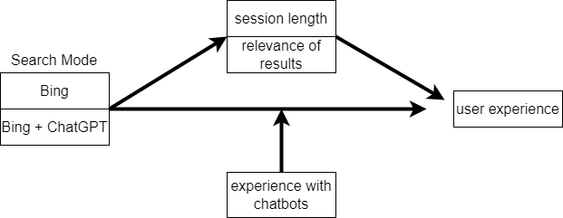
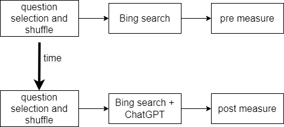

---
title: "Coursework assignment A - 2022-2023"
subtitle: "CS4125 Seminar Research Methodology for Data Science"
author: "Student names"
date: "16/04/2023"
output:
   pdf_document:
      fig_caption: true
      number_sections: true
---

```{r setup, include=FALSE}
knitr::opts_chunk$set(echo = TRUE)
```

\tableofcontents

# Part 1 - Design and set-up of true experiment

## The motivation for the planned research

-   Introduced large language models
-   chatbots are supposed to imporove user experience by making it more natural.
-   is this the case in the newily introduced Bing search engine (GPT based).
-   there is a lot of hype but it is unclear if it acctually improves user experience

## The theory underlying the research

(Max 200 words) Preferable based on theories reported in literature

## Research questions

How does the integration of chat gpt affect the user experience in the new bing search engine?

## The related conceptual model


Independent variable: Search Mode - categorial variable - ChatGPT, standard
Dependent variable： user experiences
Mediating variable (at least 1)：session length, relevance of results
Moderating variable (at least 1): Experience with chatbots

## Experimental Design

Hypothesis: the use of chatGPT has a positive effect on user experience during search.

Design: we use a within-subject experiment. First each participant gets a set of questions to which they should find the answer using the regular Bing search engine. Then, the user experience is evaluated using a questionnaire. Afterwards, the participant is again presented with a new set of questions to which they should find the answers using the search engine with the chatGPT integration. The user experience is again evaluated using a questionnaire. To make sure that the type of questions are equally hard between the two search experiments, we randomly select half of the total number of questions for each of the experiments.


## Experimental procedure

A room is prepared with a laptop with two search engines in it: search engine 1 is a standard version of Bing, search engine 2 is Bing with Chat-GPT integration.
Each participant is called into the room and is given a set of questions to answer or find information for. The participant uses the Bing search engine to find information for those questions. Afterwards the user is given a questionnaire to answer. Then, the participant is given a new set of questions and uses the Bing with Chat-GPT engine after which he/she is given the same questionnaire again. Break up order of questions.

## Measures

We use a questionnaire that should give us an indication of the perceived user experience of the participants for both the normal search engine and the chatGPT integrated search engine. 
Type of question scale
Ordinal, nominal,  likert, etc.
The questionnair is given directly to the participants after each trial with a search engine.
We evaluate perceived user experience by a set of categories, e.g. speed to find the answer, readability of the answer, overall satisfaction. Interval likert scale. Reversing scores.

## Participants

We want to find a group of participants in Delft as diverse as possible, because we want to find the general user experience improvement. If we only take a subsample of the population, like elderly people or students, we do not get a very general idea and loose external validity.  We need 119 people, because we use a Likert scale using intervals. This provides us with a 95% confidence interval.

## Suggested statistical analyses

We want to find the difference between the user experience to see if it has increased. This means that the results of the two experiments have to be paired with each other. The results of the two experiments are dependent, because a participant maybe in general already gives higher ratings. So this means that with our interval questions, we could use a paired sample t-test or repeated measure ANOVA.

# Part 2 - Generalized linear models

## Question 1 Twitter sentiment analysis (Between groups - single factor)

### Conceptual model

Individual → Sentiment of tweets

### Model description
The model that we fit on the data is normal distribution where the mean is dependent on the individual that tweeted the tweet. So we have norm(mu, sigma), with mu=a[id_indv], a[id_indv]=norm(..,..) and sigma=unif(..,..).

### Generate Synthetic data

Create a synthetic data set with a clear difference between tweets' sentiments of celebrities for verifying your analysis later on. Report the values of the coefficients of the linear model used to generate synthetic data. (hint, look at class lecture slides of lecture on Generalized linear models for example to create synthetic data)

```{r}
library(twitteR)
#install.packages("RCurl", dependencies = T)
library(RCurl)
#install.packages("bitops", dependencies = T)
library(bitops)
#install.packages("plyr", dependencies = T)
library(plyr)
#install.packages('stringr', dependencies = T)
library(stringr)
#install.packages("NLP", dependencies = T)
library(NLP)
#install.packages("tm", dependencies = T)
library(tm)
#install.packages("wordcloud", dependencies=T)
#install.packages("RColorBrewer", dependencies=TRUE)
library(RColorBrewer)
library(wordcloud)
#install.packages("reshape", dependencies=T)
library(reshape)

#include your code for generating the synthetic data
# Synthesis of a test data set.
sequence <- seq(-10, 10, by = .1)
test_T = rnorm(sequence, mean=-5, sd=2)
test_C = rnorm(sequence, mean=0, sd=2)
test_B = rnorm(sequence, mean=5, sd=2)

sem_test<-data.frame(test_T, test_C, test_B)

semFrameTest <-melt(sem_test, measured=c(test_T, test_C, test_B))
names(semFrameTest) <- c("Candidate", "score")
semFrameTest$Candidate <-factor(semFrameTest$Candidate, labels=c("Donald Trump", "Hillary Clinton", "Bernie Sanders"))
```

### Collecting tweets, and data preparation

Include the annotated R script (excluding your personal Keys and Access Tokens information), but put echo=FALSE, so code is not included in the output pdf file.

```{r, echo=FALSE, message=FALSE, warning=FALSE, include = FALSE, eval=FALSE}

#during writing you could add "eval = FALSE",  kntr will than not run this code chunk (take some time do)

setwd("~/surfdrive/Teaching/own teaching/IN4125 - Seminar Research Methodology for Data Science/2019/coursework A") 
# apple , note use / instead of \, which used by windows


#install.packages("twitteR", dependencies = TRUE)


################### functions

  
clearTweets <- function(tweets, excl) {
  
  tweets.text <- sapply(tweets, function(t)t$getText()) #get text out of tweets 

  
  tweets.text = gsub('[[:cntrl:]]', '', tweets.text)
  tweets.text = gsub('\\d+', '', tweets.text)
  tweets.text <- str_replace_all(tweets.text,"[^[:graph:]]", " ") #remove graphic
  
  
  corpus <- Corpus(VectorSource(tweets.text))
  
  corpus_clean <- tm_map(corpus, removePunctuation)
  corpus_clean <- tm_map(corpus_clean, content_transformer(tolower))
  corpus_clean <- tm_map(corpus_clean, removeWords, stopwords("english"))
  corpus_clean <- tm_map(corpus_clean, removeNumbers)
  corpus_clean <- tm_map(corpus_clean, stripWhitespace)
  corpus_clean <- tm_map(corpus_clean, removeWords, c(excl,"http","https","httpst"))
  

  return(corpus_clean)
} 


## capture all the output to a file.

################# Collect from Twitter

# for creating a twitter app (apps.twitter.com) see youtube https://youtu.be/lT4Kosc_ers
#consumer_key <-'your key'
#consumer_scret <- 'your secret'
#access_token <- 'your access token'
#access_scret <- 'your access scret'

# source("wpb_twitter.R") #this file will set my personal variables for my twitter app, adjust the name of this file. use the provide template your_twitter.R
# 
# setup_twitter_oauth(consumer_key,consumer_scret, access_token,access_scret) #connect to  twitter app
# 
# 
# ##### This example uses the following 3 celebrities: Donald Trump, Hillary Clinton, and Bernie Sanders
# ##  You should replace this with your own celebrities, at least 3, but more preferred 
# ##  Note that it will take the computer some to collect the tweets
# 
# tweets_T <- searchTwitter("#trump", n=100, lang="en", resultType="recent") #n recent tweets about Donald Trump, in English ( Twitter sometimes modifies number of tweets that you can collect)
# tweets_C <- searchTwitter("#hillary", n=100, lang="en", resultType="recent") #n recent tweets about Hillary Clinton
# tweets_B <- searchTwitter("#bernie", n=100, lang="en", resultType="recent") #n recent tweets about Bernie Sanders

#overtime Twitter allow fewer tweets to be collected so you might have to adjust this number

######################## Sentiment analysis

tweets_T <- scan('data/tweets_T.txt', what = 'character', comment.char=';', sep="\n")
tweets_C <- scan('data/tweets_C.txt', what = 'character', comment.char=';', sep="\n")
tweets_B <- scan('data/tweets_B.txt', what = 'character', comment.char=';', sep="\n")
# tweets_T.text <- laply(test, function(t)t$getText()) #get text out of tweets
# tweets_C.text <- laply(tweets_C, function(t)t$getText()) #get text out of tweets
# tweets_B.text <- laply(tweets_B, function(t)t$getText()) #get text out of tweets


#taken from https://github.com/mjhea0/twitter-sentiment-analysis
pos <- scan('data/positive-words.txt', what = 'character', comment.char=';') #read the positive words
neg <- scan('data/negative-words.txt', what = 'character', comment.char=';') #read the negative words

source("sentiment3.R") #load algorithm
# see sentiment3.R form more information about sentiment analysis. It assigns a integer score
# by subtracting the number of occurrence of negative words from that of positive words

analysis_T <- score.sentiment(tweets_T, pos, neg)
analysis_C <- score.sentiment(tweets_C, pos, neg)
analysis_B <- score.sentiment(tweets_B, pos, neg)


sem<-data.frame(analysis_T$score, analysis_C$score, analysis_B$score)


semFrame <-melt(sem, measured=c(analysis_T.score,analysis_C.score, analysis_B.score ))
names(semFrame) <- c("Candidate", "score")
semFrame$Candidate <-factor(semFrame$Candidate, labels=c("Donald Trump", "Hillary Clinton", "Bernie Sanders")) # change the labels for your individual/organisation

#The data you need for the analyses can be found in semFrame

```

### Visual inspection Mean and distribution sentiments

The data distributions show that each individual seems to have a sentiment with a normal distribution with a mean around 0. For the Trump data, there seem to be more more values with a higher sentiment. If we look at the boxplots, we see that Trump seems to have the most positive sentiment, but he also has more extreme maxima. Hillary also seems to be a bit less positive than Bernie.

```{r}
#include your analysis code and output in the document
trump_inspect = subset(semFrame, (Candidate == "Donald Trump"), select=c(score))
hillary_inspect = subset(semFrame, (Candidate == "Hillary Clinton"), select=c(score))
bernie_inspect = subset(semFrame, (Candidate == "Bernie Sanders"), select=c(score))

hist(trump_inspect$score)
hist(hillary_inspect$score)
hist(bernie_inspect$score)

stem(trump_inspect$score)
stem(hillary_inspect$score)
stem(bernie_inspect$score)

library(sm)
sm.density.compare(semFrame$score, semFrame$Candidate, xlab = "sentiment score")
title(main="Sentiment per individual")
legend('topright', legend=levels(semFrame$Candidate), col=c('red', 'blue', 'green'), lty=1:2, cex=0.8,
title="Individual", text.font=4, bg='lightblue')

boxplot(semFrame$score ~ semFrame$Candidate, data=semFrame, main="Sentiment",
xlab="Individual", ylab="Sentiment")
```

### Frequentist approach

#### Analysis verification

If we input the synthetic data into the model, we see that the individuals are indeed significant for the sentiment we get out of the tweet. This is what we expected, since this is how we created the data. A summary of the model reveals that the means of the groups in the model are indeed the means that we set of the distribution. This can be seen in the coefficient section below. The p-value with a factor of 10**-16 is way lower than the needed 0.05, which shows us that the individuals have a significant effect on the resulting sentiment. The F-value of 1243 shows us that the variation between sample means is way larger than the variance within samples. This again shows that there is a big difference between the individuals.

```{r}
#include your analysis code of synthetic data and output in the document
model0 <- lm(semFrameTest$score ~ 1, data = semFrameTest) # model without predictor
model1 <- lm(semFrameTest$score ~ semFrameTest$Candidate, data = semFrameTest) # model with predictor
anova(model0, model1)
summary(model1)

# TODO: AICc
```

#### Linear model {#linear-model}

If we input the actual data into the model, we see that the individuals are indeed significant for the sentiment we get out of the tweet. This can be concluded by looking at the p and F-value. The p-value with a factor of 10**-6 is way lower than the needed 0.05, which shows us that the individuals have a significant effect on the resulting sentiment. The F-value of 13.478 shows us that the variation between sample means is way larger than the variance within samples. This again shows that there is a difference between the individuals, regarding tweet sentiment.

```{r}
#include your analysis code and output in the document
model0 <- lm(semFrame$score ~ 1, data = semFrame) # model without predictor
model1 <- lm(semFrame$score ~ semFrame$Candidate, data = semFrame) # model with predictor
anova(model0, model1)
summary(model1)

# TODO: AICc
```

#### Post Hoc analysis

If we conduct a bonferroni post hoc analysis, we see that all Donald Trump has a significant difference with both Hillary and Bernie, regarding tweet sentiment. However, we also see that the tweet sentiment difference of Bernie and Hillary is not significant.

The results of the normality tests show us that the spread of tweet sentiments per individual can indeed be seen as a normal distribution. This confirms the normality assumption.

The results of the levene test show that we can indeed assume the individual normal distributions to have the same variance.

So the post-hoc analysis shows that our assumptions of the date could indeed be made.

```{r}
#include your code and output in the document
pairwise.t.test(semFrame$score, semFrame$Candidate,
paired = FALSE, p.adjust.method = "bonferroni")
plot(model1)

library(car)
tapply(semFrame$score, semFrame$Candidate, shapiro.test)
leveneTest(semFrame$score, semFrame$Candidate)
```

#### Report section for a scientific publication

The analysis focuses on the effect of an individual on the sentiment of their tweets. In the experiment, two models are created. The first model only has an intercept and no additional information about the individual that tweeted the tweet. The second model does have this information. The experiment has shown that the addition of data about the individual significantly improves the model (F=13.478, p=2.496e-06). 

Moreover, a post-hoc analysis of the experiment was conducted. This showed that the sentiment differences between Donald Trump and Hillary Clinton (p=5.5e-06) and Bernie Sanders (p=0.00024) were significant. However, the sentiment difference between Hillary and Bernie (p=1) was not significant. The post-hoc analysis also showed that the model assumptions regarding normality and equal variances could be made. The Shapiro-Wilk normality tests showed that for both Trump (W = 0.85938, p-value = 2.676e-08), Hillary (W = 0.91847, p-value = 1.168e-05) and Bernie (W = 0.92669, p-value = 3.247e-05) the distributions can be regarded as normal distributions. Finally, Levene's test for homogeneity of variances showed that all distributions indeed have equal variances (F=14.217, Pr(>F)=1.269e-06).

### Bayesian Approach

For the Bayesian analyses, use the rethinking and/or BayesianFirstAid library 

#### Analysis verification 
Verify your model analysis with synthetic data and show that it can reproduce the coefficients of the linear model that you used to generate the synthetic data set. Provide a short interpretation of the results, with a reflection of WAIC, and 95% credibility interval of coefficients for individual celebrities.

We fit two models, a model with only an intercept and a model with the relation between sentiment and individual added. The second model has a better fit, since its WAIC value is lower than the model without the additional relation.

We can see that the means of the synthetic data are correctly reproduced by the second model. a[1], a[2] and a[3] correspond to the synthetic Trump, Hillary and Bernie data. Also sigma of 1.98 is almost a precise reproduction of the actual sd of 2. For a[1], a[2] and a[3] the 95% credible intervals are [-5.18,-4.63], [-0.51,0.05] and [4.66,5.21] respectively.

```{r}
library(rethinking)
#include your analysis code of synthetic data and output in the document
da <- subset(semFrameTest, select = c(score, Candidate))
m0 <-map2stan(
  alist(
    score ~ dnorm(mu, sigma),
    mu <- a,
    a ~ dnorm(0, 10),
    sigma ~ dunif(0.001, 20)
  ), data = da, iter = 10000, chains = 4, cores = 4
)
m1 <-map2stan(
  alist(
    score ~ dnorm(mu, sigma),
    mu <- a[Candidate] ,
    a[Candidate] ~ dnorm(0, 10),
    sigma ~ dunif(0.001, 20)
  ), data = da, iter = 10000, chains = 4, cores = 4
)
precis(m1, depth = 2, prob = .95)
compare(m0, m1)
```

#### Model comparison

Redo the analysis on the actual tweet data set. Provide a short interpretation of the results, with a reflection of WAIC, and 95% credibility interval of coefficients for individual celebrities.

Again we make two models, one with only intercept and one with an additional relation to the individual. The WAIC shows that the model with the additional relation is better than the model with only intercept. The 95% credible intervals are [0.74,1.34] for Trump, [-0.32,0.29] for Hillary and [-0.14,0.48] for Bernie. It shows that there is no overlap between Trump and any other in the credible intervals, but there is some overlap between Hillary and Bernie.

```{r}
#include your code and output in the document
dat <- subset(semFrame, select = c(score, Candidate))
m0 <-map2stan(
  alist(
    score ~ dnorm(mu, sigma),
    mu <- a ,
    a ~ dnorm(0, 10),
    sigma ~ dunif(0.001, 20)
  ), data = dat, iter = 10000, chains = 4, cores = 4
)
m1 <-map2stan(
  alist(
    score ~ dnorm(mu, sigma),
    mu <- a[Candidate] ,
    a[Candidate] ~ dnorm(0, 10),
    sigma ~ dunif(0.001, 20)
  ), data = dat, iter = 10000, chains = 4, cores = 4
)
precis(m1, depth = 2, prob = .95)
compare(m0, m1)
```

#### Comparison individual/organisation pair

We compare the three possible pairs, and we see basically the same results as in the frequentist approach. The 95% credible intervals with Trump both do not include 0, which makes it likely that the tweet sentiments of the others are not equal to those of Trump. We can also see that the 95% credible interval of Hillary and Bernie does contain 0, which still maintains the possibility that there is not a difference in tweet sentiments between these two individuals.

```{r}
#include your code and output in the document
post <- extract.samples(m1, n=1e5)
diffhill_trump <- post$a[,1] - post$a[,2]
diffhill_bernie <- post$a[,2] - post$a[,3]
difftrump_bernie <- post$a[,1] - post$a[,3]
PI(diffhill_trump, prob = 0.95 )
PI(diffhill_bernie, prob = 0.95 )
PI(difftrump_bernie, prob = 0.95 )
```

## Question 2 - Website visits (between groups - Two factors)

### Conceptual model

Make a conceptual model underlying this research question


### Specific Mathematical model

Describe the mathematical model that you fit on the data. Take for this the complete model that you fit on the data. Also, explain your selection for the priors. Assume Gaussian distribution for the number of page visits.


The model can expressed as follows:

pages ~ Norm(mu, sigma)

mu = Beta0 + Beta1 * version + Beta2 * portal + Beta3 * version * portal

Beta0  ~ dnorm(20, 10)

c(Beta1, Beta2, Beta3) ~ dnorm(10,10)

sigma ~ dunif(0.001, 40)


The model assumes a Gaussian distribution for the number of page visits, with relatively uninformed priors assigned to the intercept and coefficients (Beta0, Beta1, Beta2, Beta3) as well as the standard deviation (sigma). The interaction term (version * portal) captures the combined effect of the website version and portal. To account for uncertainty, a weakly informative prior is chosen for sigma using a uniform distribution with a range that encompasses a broad yet plausible set of values.

### Create Synthetic data

Create a synthetic data set with a clear interaction effect between the two factors for verifying your analysis later on. Report the values of the coefficients of the linear model used to generate synthetic data.

```{r}
#include your code for generating the synthetic data

# Set the seed for reproducibility
set.seed(1)

# Specify the sample size
n <- 100

# Create the independent variables
version <- rep(c(0, 1), each = n/2)
portal <- rep(c(0, 1), times = n/2)

# Generate the interaction effect
interaction <- version * portal

# the values of the coefficients of the linear model
beta0 <- 2.5     # Intercept
beta1 <- 1.5     # Coefficient for version
beta2 <- 0.8     # Coefficient for portal
beta3 <- 0.7     # Coefficient for interaction

# Generate the dependent variable (number of page visits)
pages <- beta0 + beta1 * version + beta2 * portal + beta3 * interaction + rnorm(n,0,1)

# Combine the variables into a data frame
fake_data <- data.frame(version, portal, interaction, pages)

# View the first few rows of the synthetic data set
head(fake_data)

```


### Visual inspection

Graphically examine the mean page visits for the four different conditions. Give a short explanation of the figure.


```{r}
#include your code and output in the document

# Load the required library
library(ggplot2)

web_data <- read.csv("data/webvisit0.csv") 
web_data$version <- factor(web_data$version, levels = c(0:1), labels = c("Old","New"))
web_data$portal <- factor(web_data$portal, levels = c(0:1), labels = c("Consumers","Companies"))

bar <- ggplot(web_data, aes(version , pages, fill = portal))
bar + stat_summary(fun.y = mean, geom = "bar", position="dodge")
# 
# box <- ggplot(web_data, aes(version, pages, fill = portal))
# box + geom_boxplot()

```

The figure shows the mean page visits obtained in four conditions. The analysis revealed that the combination of the new version and web portal for companies resulted in a highest number of page visits. Furthermore, regardless of the website version, the portal for companies showed a higher number of page visits compared to the portal for consumers. Additionally, irrespective of the portal, the old version exhibited fewer page visits compared to the new version. Last, large difference between the portals for consumers and companies exist in both the new and old version conditions.


### Frequentist Approach

#### Model verification

Verify your model analysis with synthetic data and show that it can reproduce the coefficients of the linear model that you used to generate the synthetic data set. Provide a short interpretation of the results, with a reflection of AICc, F-value, p-value etc.

```{r}
#include your analysis code of synthetic data and output in the document

library(pander) #for rendering output
library(AICcmodavg) #aictab

# Fit the linear regression model
model0 <- lm(pages ~ 1, data = fake_data, na.action = na.exclude)
model1 <- lm(pages ~ version, data = fake_data, na.action = na.exclude)
model2 <- lm(pages ~ portal, data = fake_data, na.action = na.exclude)
model3 <- lm(pages ~ version + portal, data = fake_data, na.action = na.exclude)
model4 <- lm(pages ~ version + portal + version:portal, data = fake_data, na.action = na.exclude)

# see the values of coeffients
summary(model0)
summary(model1)
summary(model2)
summary(model3)
summary(model4)


# compare the models with each other.
pander(anova(model0,model1), caption = "version as main effect on page visits")
pander(anova(model0,model2), caption = "portal as main effect on page visits")
pander(anova(model3,model4), caption = "Interation effect on top of two main effects")
pander(anova(model4), caption = "Effect of version, portal and interaction effect on page visits")


models <-list(model0, model1, model2, model3, model4)
model.names <-c("model0","model1","model2","model3","model4")
aictab(cand.set = models, modnames=model.names)


```

The results indicate that the website version, portal, and their interaction effect have a significant impact on the number of page visits (p < 0.01). Model 4, which includes the interaction effect, demonstrates the best goodness-of-fit with the smallest AICc value. The reproduced coefficients in Model 4 closely align with the original ones, further supporting its superiority over the other models.


#### Model analysis with Gaussian distribution assumed

Redo the analysis now on the real data set. Assume Gaussian distribution for the number of page visits. Provide a short interpretation of the results, with an interpretation of AICc, F-value, p-value, etc.


```{r}
#include your code and output in the document

#include your analysis code of synthetic data and output in the document

#read data and add interaction
# web_data <- read.csv("data/webvisit0.csv") 
# web_data$interaction <- web_data$version * web_data$portal

web_data$version <-as.numeric(web_data$version)
web_data$portal <-as.numeric(web_data$portal)

# Fit the linear regression model
model0 <- lm(pages ~ 1, data = web_data, na.action = na.exclude)
model1 <- lm(pages ~ version, data = web_data, na.action = na.exclude)
model2 <- lm(pages ~ portal, data = web_data, na.action = na.exclude)
model3 <- lm(pages ~ version + portal, data = web_data, na.action = na.exclude)
model4 <- lm(pages ~ version + portal + version:portal, data = web_data, na.action = na.exclude)

# see the values of coeffients
# summary(model0)
# summary(model1)
# summary(model2)
# summary(model3)
summary(model4)


# compare the models with each other.
pander(anova(model0,model1), caption = "version as main effect on page visits")
pander(anova(model0,model2), caption = "portal as main effect on page visits")
pander(anova(model3,model4), caption = "Interation effect on top of two main effects")
pander(anova(model4), caption = "Effect of version, portal and interaction effect on page visits")


models <-list(model0, model1, model2, model3, model4)
model.names <-c("model0","model1","model2","model3","model4")
aictab(cand.set = models, modnames=model.names)
```

The results indicate that the website version, portal, and their interaction effect have a significant impact on the number of page visits (p < 0.01). Model 4, which includes the interaction effect, demonstrates the best goodness-of-fit with the smallest AICc value. 

#### Assumption analysis

Redo the analysis on the real tweet data set.  This time assume a Poisson distribution for the number of page visits. For the best fitting models (Gaussian and Poisson), examine graphically the distribution of the residuals for the model that assumes Gaussian distribution and the model that assumes Poisson distribution. Give a brief interpretation of Poisson and Gaussian distribution assumptions.

```{r}
#include your code and output in the document

gaussian_model <- lm(pages ~ version + portal + version:portal, data = web_data)
poisson_model <- glm(pages ~ version + portal + version:portal, data = web_data, family = poisson)
summary(gaussian_model)
summary(poisson_model)


# # Residual analysis
# poisson_residuals <- resid(poisson_model)
# gaussian_residuals <- resid(gaussian_model)
# 
# shapiro.test(resid(poisson_model))
# shapiro.test(resid(gaussian_model))

# # Histogram of Poisson model residuals
# hist(poisson_residuals, breaks = 30, col = "lightblue", main = "Poisson Model Residuals")
# 
# # Density plot of Gaussian model residuals
# hist(gaussian_residuals, breaks = 30, col = "lightblue", main = "Gaussian Model Residuals")

# parameters for diagnostic: https://stat.ethz.ch/R-manual/R-devel/library/stats/html/plot.lm.html
# interpration: https://www.statology.org/diagnostic-plots-in-r/

par(mfrow = c(1, 2))
plot(gaussian_model, which = 1, main = "Residuals vs. Fitted - Gaussian Model")
plot(poisson_model, which = 1, extend.ylim.f = c(3.,3.), main = "Residuals vs. Fitted - Poisson Model")


par(mfrow = c(1, 2))
plot(gaussian_model, which = 3, main = "Scale-Location Plot - Gaussian Model")
plot(poisson_model, which = 3, extend.ylim.f = c(3.,4.5), main = "Scale-Location Plot - Poisson Model")


par(mfrow = c(1, 2))
plot(gaussian_model, which = 2, main = "Normal Q-Q Plot - Gaussian Model")
plot(poisson_model, which = 2, extend.ylim.f = c(-0.4,4.5), main = "Normal Q-Q Plot - Poisson Model")


plot(gaussian_model, which = 5, main = "Residuals vs. Leverage - Gaussian Model")
plot(poisson_model, which = 5, extend.ylim.f = c(3.,5.5), main = "Residuals vs. Leverage - Poisson Model")


```

The "Residuals vs. Fitted" and "Scale-Location" plots indicate that the spread of residuals in the Gaussian model increases as the fitted values change, suggesting a violation of the Gaussian assumption. However, for the Poisson model, the spread of residuals remains relatively constant, indicating that the Poisson assumption holds true and it is more suitable to assume a poisson distribution for page visits.

#### Simple effect analysis

Continue with the model that assumes a Poisson distribution. If the analysis shows a significant two-way interaction effect, conduct a Simple Effect analysis to explore this interaction effect in more detail. Provide a brief interpretation of the results.


```{r}
#include your code and output in the document

library(rethinking)
summary(poisson_model)


library(pander)

# portal
# create two contrasts and combine them and associate the contrast to a variable
web_data$simple_portal<- interaction(web_data$version, web_data$portal) #merge two factors
levels(web_data$simple) #to see the level in the new factor

contrastConsumers <-c(-1,1,0,0) 
contrastCompanies <-c(0,0,-1,1) 

SimpleEff <- cbind(contrastConsumers,contrastCompanies)
contrasts(web_data$simple_portal) <- SimpleEff #now we link the two contrasts with the version

# we fit a linear model on the data, using this two-level variable as an independent factor.
simpleEffectModel <-lm(pages ~ simple_portal , data = web_data, na.action = na.exclude)
pander(summary.lm(simpleEffectModel))

# version
# create two contrasts and combine them and associate the contrast to a variable
web_data$simple_version<- interaction(web_data$version, web_data$portal) #merge two factors
levels(web_data$simple_version) #to see the level in the new factor

contrastOld <-c(-1,0,1,0) 
contrastNew <-c(0,-1,0,1) 

SimpleEff <- cbind(contrastOld,contrastNew)
contrasts(web_data$simple_version) <- SimpleEff #now we link the two contrasts with the version

# we fit a linear model on the data, using this two-level variable as an independent factor.
simpleEffectModel <-lm(pages ~ simple_version , data = web_data, na.action = na.exclude)
pander(summary.lm(simpleEffectModel))

```

The analysis investigated the interaction effect between two variables, version and portal, by dividing the data into two groups. The results indicate significant differences (p < 0.01) in the number of page visits based on the version type for both company and consumer portals. Additionally, the portal variable also has a significant impact (p < 0.01) on page visits for both the old and new versions of the website. Furthermore, the contrasts for both version and portal variables are also statistically significant (p < 0.01).

#### Report section for a scientific publication

Write a small section for a scientific publication, in which you report the results of the analyses, and explain the conclusions that can be drawn.

A linear model was fitted to analyze the number of page visits on a website, considering the website version and portal as independent variables, with a two-way interaction. The results indicated significant main effects for both the version (F(1, 996) = 563, p < 0.01) and the portal (F(1, 996) = 6886, p < 0.01). Furthermore, a significant two-way interaction effect was observed (F(1, 996) = 1882, p < 0.01). Further analysis of the interaction revealed a significant difference (p < 0.01) in page visits based on the website portal for old/new website version. Additionally,  the website version also has a significant impact (p < 0.01) on page visits for both the companies and consumers portals.


### Bayesian Approach

For the Bayesian analyses, use the rethinking and/or BayesianFirstAid library

####  Verification Analysis

Verify your model analysis with synthetic data and show that it can reproduce the coefficients of the linear model that you used to generate the synthetic data set. Provide a short interpretation of the results, with a reflection of WAIC, and 95% credibility interval of coefficients for individual celebrities.


```{r}
#include your analysis code of synthetic data and output in the document
library(rethinking)
library(rstan)

options(mc.cores = parallel::detectCores())
rstan_options(auto_write = TRUE)

# fake_data$version <-as.numeric(fake_data$version) 
# fake_data$portal <-as.numeric(fake_data$portal) 

model_bay_fake0 <- map2stan(
  alist(
    pages ~ dnorm(mu, sigma),
    mu <- Beta0,
    Beta0 ~ dnorm(2,2),
    sigma ~ dunif(0.1,2)
    ),
  data = fake_data,
  chains = 4,
  cores = 4,
  iter = 10000
)

model_bay_fake1 <- map2stan(
  alist(
    pages ~ dnorm(mu, sigma),
    mu <- Beta0 + Beta1 * version,
    Beta0 ~ dnorm(2,2),
    Beta1 ~ dnorm(2,2),
    sigma ~ dunif(0.1,2)
    ),
  data = fake_data,
  chains = 4,
  cores = 4,
  iter = 10000
)

model_bay_fake2 <- map2stan(
  alist(
    pages ~ dnorm(mu, sigma),
    mu <- Beta0 + Beta2 * portal,
    Beta0 ~ dnorm(2,2),
    Beta2 ~ dnorm(1,2),
    sigma ~ dunif(0.1,2)
    ),
  data = fake_data,
  chains = 4,
  cores = 4,
  iter = 10000
)

model_bay_fake3 <- map2stan(
  alist(
    pages ~ dnorm(mu, sigma),
    mu <- Beta0 + Beta1 * version + Beta2 * portal,
    Beta0 ~ dnorm(2,2),
    Beta1 ~ dnorm(2,2),
    Beta2 ~ dnorm(1,2),
    sigma ~ dunif(0.1,2)
    ),
  data = fake_data,
  chains = 4,
  cores = 4,
  iter = 10000
)

model_bay_fake4 <- map2stan(
  alist(
    pages ~ dnorm(mu, sigma),
    mu <- Beta0 + Beta1 * version + Beta2 * portal + Beta3 * version * portal,
    Beta0 ~ dnorm(2,2),
    Beta1 ~ dnorm(2,2),
    Beta2 ~ dnorm(1,2),
    Beta3 ~ dnorm(1,2),
    sigma ~ dunif(0.1,2)
    ),
  data = fake_data,
  chains = 4,
  cores = 4,
  iter = 10000
)

compare(model_bay_fake0,model_bay_fake1,model_bay_fake2,model_bay_fake3,model_bay_fake4)

# precis(model_bay_fake0, prob= .95)
# precis(model_bay_fake1, prob= .95)
# precis(model_bay_fake2, prob= .95)
# precis(model_bay_fake3, prob= .95)
precis(model_bay_fake4, prob= .95)

```

Model_bay_fake4, which includes the combination of version, portal, and the interaction effect, exhibits the lowest WAIC value, indicating the best out-of-sample fit among the models compared. Additionally, the credible intervals for all coefficients encompass their original values, suggesting that the estimated coefficients are statistically consistent with the data.

#### Model description

Describe the mathematical model fitted on the most extensive model. (hint, look at the mark down file of the lectures to see example on formulate mathematical models in markdown). Assume Poisson distribution for the number of page visits. Justify the priors.


Model:

Pages ~ Poisson(lambda) 

lambda = exp(Beta0 + Beta1 * version + Beta2 * portal + Beta3 * version * portal)

Beta0 ~ Normal(10, 20) 
Beta1 ~ Normal(10, 20)
Beta2 ~ Normal(10, 20)
Beta3 ~ Normal(10, 20)


Priors:

Because there is limited prior information or no strong prior beliefs, I use weakly informative priors that allow the data to have a larger influence on the posterior results.


#### Model comparison

Redo the analysis on actual data. Assume Poisson distribution for the number of page visits. Provide brief interpretation of the analysis results (e.g. WAIC, and 95% credibility interval of coefficients).

```{r}
#include your code and output in the document


# Model formulation


model_bay_web0 <- map2stan(
  alist(
    pages ~ dpois(lambda),
    log(lambda) <- Beta0,
    Beta0 ~ dnorm(10, 20)
    ),
  data = web_data,
  chains = 4,
  cores = 4,
  iter = 10000
)

model_bay_web1 <- map2stan(
  alist(
    pages ~ dpois(lambda),
    log(lambda) <- Beta0 + Beta1 * version ,
    Beta0 ~ dnorm(10, 20),
    Beta1 ~ dnorm(10, 20)
    ),
  data = web_data,
  chains = 4,
  cores = 4,
  iter = 10000
)

model_bay_web2 <- map2stan(
  alist(
    pages ~ dpois(lambda),
    log(lambda) <- Beta0  + Beta2 * portal,
    Beta0 ~ dnorm(10, 20),
    Beta2 ~ dnorm(10, 20)
    ),
  data = web_data,
  chains = 4,
  cores = 4,
  iter = 10000
)

model_bay_web3 <- map2stan(
  alist(
    pages ~ dpois(lambda),
    log(lambda) <- Beta0 + Beta1 * version + Beta2 * portal,
    Beta0 ~ dnorm(10, 20),
    Beta1 ~ dnorm(10, 20),
    Beta2 ~ dnorm(10, 20)
    ),
  data = web_data,
  chains = 4,
  cores = 4,
  iter = 10000
)

model_bay_web4 <- map2stan(
  alist(
    pages ~ dpois(lambda),
    log(lambda) <- Beta0 + Beta1 * version + Beta2 * portal + Beta3 * version * portal,
    Beta0 ~ dnorm(10, 20),
    Beta1 ~ dnorm(10, 20),
    Beta2 ~ dnorm(10, 20),
    Beta3 ~ dnorm(10, 20)
    ),
  data = web_data,
  chains = 4,
  cores = 4,
  iter = 10000
)


precis(model_bay_web4, prob = .95)
compare(model_bay_web0,model_bay_web1,model_bay_web2,model_bay_web3,model_bay_web4)

```

The model_bay_web4, which incorporates the combination of version, portal, and the interaction effect, demonstrates the lowest WAIC value, indicating superior out-of-sample fit compared to the other models evaluated. The inclusion of both web portal and the interaction effect results in a substantial decrease in the WAIC, suggesting the significance of these two factors in explaining the observed data. Furthermore, the credible intervals for all coefficients encompass their values when using a linear function, indicating that the estimated coefficients are statistically consistent.


# Part 3 - Multilevel model

## Visual inspection

Use graphics to inspect the distribution of the score, and relationship between session and score. Give a short description of the figure.

```{r}
#include your code and output in the document
library(sm)
library(car)

set0 <- read.csv("data/set1.csv")
#stem leaf plot is useless in this case
#stem(set1$score, atom = 1e-04)

hist(set0$score, xlab="scores", main="score frequencies histogram")
hist(set0$session, xlab="sessions", main="session frequencies histogram")

# Define color gradient
color_range <- colorRampPalette(c("blue", "red"))

# Assign colors based on session number
color_vector <- color_range(length(unique(set0$session)))[as.numeric(unique(set0$session))]
lty_vector <- rep(1, each=length(unique(set0$session)))

note_text <- "17"


den <- sm.density.compare(set0$score, group = set0$session, h=2.5, col= color_vector, lty=lty_vector)
title(main="score density by session")
#text(x=0, labels ="17", adj=c(-16,-18))

legend("topleft", den$levels, lty=den$lty, lwd=den$lwd, y.intersp=1, ncol=3, col=den$col, title="session number")
boxplot(score ~ session, data=set0)
#boxplot(session ~ score, data=set0)
scatterplot(score ~ session, data=set0)

```

the first two histograms are used to understand the distribution of the dependent and independent variables. the score approximately seemed to follow a normal distribution whereas the session index seem to contain less participants as it increases, by the 17th session there's only one participant.

The third graph offer a visual inspection of the distribution of scores by session number which follows a color range from blue to red. This makes it easy to see that as the score increases the color shifts from blue to red which indicates that later sessions get higher scores.

Then I plot a box plot and a scatter plot to visualize the relationship between score and session index and indeed there seem to be a pretty clear positive effect that the session index as on the score.

## Frequentist approach

### Multilevel analysis

Conduct multilevel analysis and calculate 95% confidence intervals thereby assuming a Gaussian distribution for the scores, determine:

-   If session has an impact on people score
-   If there is significant variance between the participants in their score

```{r}
library(nlme)
ctrl <- lmeControl(opt='optim');
freq_m <- lme(score ~ session,
          data = set0,
          random = ~ session | subject,
          method="ML",
          control=ctrl
          )

summary(freq_m)
intervals(freq_m)

#include your code and output in the document
```

### Report section for a scientific publication

The experiment showed a significant association between the session number and the score obtained with t(260, N=284)=15.48, p\<0.0001 for the intercept of value 13.19 and t(260, N=284)=15.48, p\<0.0001 for the slope of value 0.99.

the relationship between sessions and scores show significant variance across subjects in the intercept SD=4.03 (95% CI: 2.99, 5.41) and in the slope SD=0.04 (95% CI: 0.01, 0.12) and the slopes and intercepts were negatively significantly correlated, cor=-.81.

## Bayesian approach

### Model description

The most complete model to predict subjects' scores assumes that the scores are Gaussian distributed. The mean, or expected value, of the score is then modeled through a linear function which depends on: a fixed intercept $a$ modeled with a normal prior. A varying intercept $a_{subject}$ with an adaptive prior, used to explain the variation of the intercept between subjects. a fixed coefficient $b$ which is the slope that explains the session effect on the score. a varying coefficient $b_{subject}$ with a fixed prior, used to explain the variation of the slope for different subjects.

The prior values, Are chosen based on the previous visual inspection of the mean and previous intercepts and coefficient values from the frequentist models.

\$ score \sim Norm(\mu, \sigma)   [likelihood]\\ \mu = a + a\_{subject} + (b + b\_{subject}) \* session    [linear  model](#linear-model)\\ a\_{subject} = Norm(0, a\_\sigma)    [adaptive  prior]\\ a\_\sigma = HalfCouch(0, 1)    [hyper  prior]\\ b\_{subject} = Norm(0,1)    [fixed  prior]\\ a = Norm(0, 1)    [fixed  prior] \\ b = Norm(0, 1)    [fixed  prior] \\ \sigma = Norm(0, 1)    [fixed  prior]

\$

### Model comparison

Compare models with with increasing complexity.

```{r}
library(rethinking)
#fixed intercept
#this model learns fixed mu for each subject and a fixed intercept
bays_m1 <- map2stan(
  alist(
    #likelihood
    score ~ dnorm(mu, sigma),
    
    #linear model
    mu <- a + a_subject[subject],
    
    #fixed priors
    a_subject[subject] ~ dnorm(0, 10),
    a ~ dnorm(15, 25),
    sigma ~ dcauchy(2,7)

  ),
  data=set0,iter = 10000,
  chains=4,log_lik = TRUE,
  cores=4,control = list(adapt_delta=.99)
)

#fixed intercept with subject adaptive prior
bays_m2<- map2stan(
  alist(
    #likelyhood
    score ~ dnorm(mu, sigma),
    
    #linear model
    mu <- a + a_subject[subject],
    
    #adaptive prior
    a_subject[subject] ~ dnorm(0, sigma_subject),
    
    #hyper prior
    sigma_subject ~ dcauchy(0, 7),
    
    #fixed prior
    a ~ dnorm(15, 25),
    sigma ~ dcauchy(2,7)
  ),
  data=set0,iter = 10000,
  chains=4,log_lik = TRUE,
  cores=4, control = list(adapt_delta=.99)
)


#adding random slope by subject
bays_m3<- map2stan(
  alist(
    #likelihood
    score ~ dnorm(mu, sigma),
    
    #linear model
    mu <- a + a_subject[subject] + (b_subject[subject]+b)*session,
    

    
    #adaptive prior
    a_subject[subject] ~ dnorm(0, a_sigma_subject),
    b_subject[subject] ~ dnorm(0, 10),


    #hyper prior
    a_sigma_subject ~ dcauchy(0, 10),

    #fixed prior
    a ~ dnorm(15, 25),
    b ~ dnorm(0, 50),
    sigma ~ dcauchy(0,10)
  ),
  data=set0,iter = 10000,
  chains=4,log_lik = TRUE,
  cores=4, control = list(adapt_delta=.99)
)


precis(bays_m1, depth=2, prob=.95)
precis(bays_m2, depth=2, prob=.95)
precis(bays_m3, depth=2, prob=.95)
compare(bays_m1, bays_m2, bays_m3)
#
```

The first two models performed very similarly (WAIC: 1623.7, 1622.6) but the third model showed a significant improvement (WAICC: 861.2) this is due to the addition of the session intercept and slope which contains most of the score variance.

### Estimates examination

the fixed intercept a is 13.04 this means that in absence of subject information during session 0 the score will be 13.04.

The fixed slope is 1.27 this means that in absence of subject information the score will increase by 1.27 for every session.

a_sigma_subject is 4.41 which means that the subject specific intercept has a standard deviation of 4.41

sigma is 1 which is the standard deviation of the score.

subject 23 is the subject with the highest average score which is on average 6.20 points above the intercept whereas subject 7 has the lowest with an intercept correction of -8.79.

subject 10 has a slope correction of -0.51 which means that he/she is the subject that improved less as session went on in relative terms.

subject 7 has a slope correction of -0.11 which means that he/she is the subject that improved the most as session went on in relative terms.
