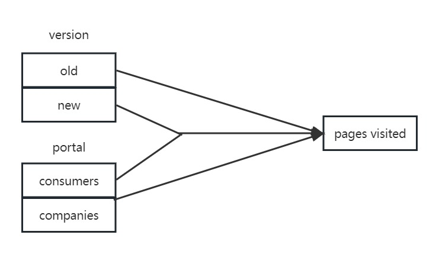

```{r setup, include=FALSE}
knitr::opts_chunk$set(echo = TRUE)
```

\tableofcontents

# Part 1 - Design and set-up of true experiment

## The motivation for the planned research

-   Introduced large language models
-   chatbots are supposed to imporove user experience by making it more natural.
-   is this the case in the newily introduced Bing search engine (GPT based).
-   there is a lot of hype but it is unclear if it acctually improves user experience

## The theory underlying the research

(Max 200 words) Preferable based on theories reported in literature

## Research questions

The research question that will be examined in an experiment (or alternatively the hypothesis that will be tested in an experiment)

## The related conceptual model

This model should include: *Independent variable(s)* Dependent variable *Mediating variable (at least 1)* Moderating variable (at least 1)

## Experimental Design

Experimental Design (the study should have a true experimental design to test a single hypothesis that, for simplicity, includes only independent variable(s) and dependent variable(s). In other words, mediating and moderating variables are not included in the experimental design )

## Experimental procedure

Describe how the experiment will be executed step by step

## Measures

Describe the measure that will be used

## Participants

Describe which participants will recruit in the study and how they will be recruited

## Suggested statistical analyses

Describe the statistical test you suggest to care out on the collected data

# Part 2 - Generalized linear models

## Question 1 Twitter sentiment analysis (Between groups - single factor)

### Conceptual model

Make a conceptual model for the following research question: Is there a difference in the sentiment of the tweets related to the different individuals/organisations?

### Model description

Describe the mathematical model fitted on the most extensive model. (hint, look at the mark down file of the lectures to see example on formulate mathematical models in markdown). Assume a Gaussian distribution for the tweet's sentiments rating. Justify the priors.

### Generate Synthetic data

Create a synthetic data set with a clear difference between tweets' sentiments of celebrities for verifying your analysis later on. Report the values of the coefficients of the linear model used to generate synthetic data. (hint, look at class lecture slides of lecture on Generalized linear models for example to create synthetic data)

```{r}
#include your code for generating the synthetic data
```

### Collecting tweets, and data preparation

Include the annotated R script (excluding your personal Keys and Access Tokens information), but put echo=FALSE, so code is not included in the output pdf file.

```{r, echo=FALSE, message=FALSE, warning=FALSE, include = FALSE, eval=FALSE}

#during writing you could add "eval = FALSE",  kntr will than not run this code chunk (take some time do)

setwd("~/surfdrive/Teaching/own teaching/IN4125 - Seminar Research Methodology for Data Science/2019/coursework A") 
# apple , note use / instead of \, which used by windows


#install.packages("twitteR", dependencies = TRUE)
library(twitteR)
#install.packages("RCurl", dependencies = T)
library(RCurl)
#install.packages("bitops", dependencies = T)
library(bitops)
#install.packages("plyr", dependencies = T)
library(plyr)
#install.packages('stringr', dependencies = T)
library(stringr)
#install.packages("NLP", dependencies = T)
library(NLP)
#install.packages("tm", dependencies = T)
library(tm)
#install.packages("wordcloud", dependencies=T)
#install.packages("RColorBrewer", dependencies=TRUE)
library(RColorBrewer)
library(wordcloud)
#install.packages("reshape", dependencies=T)
library(reshape)

################### functions

  
clearTweets <- function(tweets, excl) {
  
  tweets.text <- sapply(tweets, function(t)t$getText()) #get text out of tweets 

  
  tweets.text = gsub('[[:cntrl:]]', '', tweets.text)
  tweets.text = gsub('\\d+', '', tweets.text)
  tweets.text <- str_replace_all(tweets.text,"[^[:graph:]]", " ") #remove graphic
  
  
  corpus <- Corpus(VectorSource(tweets.text))
  
  corpus_clean <- tm_map(corpus, removePunctuation)
  corpus_clean <- tm_map(corpus_clean, content_transformer(tolower))
  corpus_clean <- tm_map(corpus_clean, removeWords, stopwords("english"))
  corpus_clean <- tm_map(corpus_clean, removeNumbers)
  corpus_clean <- tm_map(corpus_clean, stripWhitespace)
  corpus_clean <- tm_map(corpus_clean, removeWords, c(excl,"http","https","httpst"))
  

  return(corpus_clean)
} 


## capture all the output to a file.

################# Collect from Twitter

# for creating a twitter app (apps.twitter.com) see youtube https://youtu.be/lT4Kosc_ers
#consumer_key <-'your key'
#consumer_scret <- 'your secret'
#access_token <- 'your access token'
#access_scret <- 'your access scret'

# source("wpb_twitter.R") #this file will set my personal variables for my twitter app, adjust the name of this file. use the provide template your_twitter.R
# 
# setup_twitter_oauth(consumer_key,consumer_scret, access_token,access_scret) #connect to  twitter app
# 
# 
# ##### This example uses the following 3 celebrities: Donald Trump, Hillary Clinton, and Bernie Sanders
# ##  You should replace this with your own celebrities, at least 3, but more preferred 
# ##  Note that it will take the computer some to collect the tweets
# 
# tweets_T <- searchTwitter("#trump", n=100, lang="en", resultType="recent") #n recent tweets about Donald Trump, in English ( Twitter sometimes modifies number of tweets that you can collect)
# tweets_C <- searchTwitter("#hillary", n=100, lang="en", resultType="recent") #n recent tweets about Hillary Clinton
# tweets_B <- searchTwitter("#bernie", n=100, lang="en", resultType="recent") #n recent tweets about Bernie Sanders

#overtime Twitter allow fewer tweets to be collected so you might have to adjust this number

######################## Sentiment analysis

tweets_T <- scan('data/tweets_T.txt', what = 'character', comment.char=';', sep="\n")
tweets_C <- scan('data/tweets_C.txt', what = 'character', comment.char=';', sep="\n")
tweets_B <- scan('data/tweets_B.txt', what = 'character', comment.char=';', sep="\n")
# tweets_T.text <- laply(test, function(t)t$getText()) #get text out of tweets
# tweets_C.text <- laply(tweets_C, function(t)t$getText()) #get text out of tweets
# tweets_B.text <- laply(tweets_B, function(t)t$getText()) #get text out of tweets


#taken from https://github.com/mjhea0/twitter-sentiment-analysis
pos <- scan('data/positive-words.txt', what = 'character', comment.char=';') #read the positive words
neg <- scan('data/negative-words.txt', what = 'character', comment.char=';') #read the negative words

source("sentiment3.R") #load algorithm
# see sentiment3.R form more information about sentiment analysis. It assigns a integer score
# by subtracting the number of occurrence of negative words from that of positive words

analysis_T <- score.sentiment(tweets_T, pos, neg)
analysis_C <- score.sentiment(tweets_C, pos, neg)
analysis_B <- score.sentiment(tweets_B, pos, neg)


sem<-data.frame(analysis_T$score, analysis_C$score, analysis_B$score)


semFrame <-melt(sem, measured=c(analysis_T.score,analysis_C.score, analysis_B.score ))
names(semFrame) <- c("Candidate", "score")
semFrame$Candidate <-factor(semFrame$Candidate, labels=c("Donald Trump", "Hillary Clinton", "Bernie Sanders")) # change the labels for your individual/organisation

#The data you need for the analyses can be found in semFrame

```
```{r}
# Synthesis of a test data set.
sequence <- seq(-10, 10, by = .1)
test_T = rnorm(sequence, mean=-5, sd=2)
test_C = rnorm(sequence, mean=0, sd=2)
test_B = rnorm(sequence, mean=5, sd=2)

sem_test<-data.frame(test_T, test_C, test_B)

semFrameTest <-melt(sem_test, measured=c(test_T, test_C, test_B))
names(semFrameTest) <- c("Candidate", "score")
semFrameTest$Candidate <-factor(semFrameTest$Candidate, labels=c("Donald Trump", "Hillary Clinton", "Bernie Sanders"))
```

### Visual inspection Mean and distribution sentiments

The data distributions show that each individual seems to have a sentiment with a normal distribution with a mean around 0. For the Trump data, there seem to be more more values with a higher sentiment. If we look at the boxplots, we see that Trump seems to have the most positive sentiment, but he also has more extreme maxima. Hillary also seems to be a bit less positive than Bernie.

```{r}
#include your analysis code and output in the document
trump_inspect = subset(semFrame, (Candidate == "Donald Trump"), select=c(score))
hillary_inspect = subset(semFrame, (Candidate == "Hillary Clinton"), select=c(score))
bernie_inspect = subset(semFrame, (Candidate == "Bernie Sanders"), select=c(score))

hist(trump_inspect$score)
hist(hillary_inspect$score)
hist(bernie_inspect$score)

stem(trump_inspect$score)
stem(hillary_inspect$score)
stem(bernie_inspect$score)

library(sm)
sm.density.compare(semFrame$score, semFrame$Candidate, xlab = "sentiment score")
title(main="Sentiment per individual")
legend('topright', legend=levels(semFrame$Candidate), col=c('red', 'blue', 'green'), lty=1:2, cex=0.8,
title="Individual", text.font=4, bg='lightblue')

boxplot(semFrame$score ~ semFrame$Candidate, data=semFrame, main="Sentiment",
xlab="Individual", ylab="Sentiment")
```

### Frequentist approach

#### Analysis verification

If we input the synthetic data into the model, we see that the individuals are indeed significant for the sentiment we get out of the tweet. This is what we expected, since this is how we created the data. A summary of the model reveals that the means of the groups in the model are indeed the means that we set of the distribution. This can be seen in the coefficient section below. The p-value with a factor of 10**-16 is way lower than the needed 0.05, which shows us that the individuals have a significant effect on the resulting sentiment. The F-value of 1243 shows us that the variation between sample means is way larger than the variance within samples. This again shows that there is a big difference between the individuals.

```{r}
#include your analysis code of synthetic data and output in the document
model0 <- lm(semFrameTest$score ~ 1, data = semFrameTest) # model without predictor
model1 <- lm(semFrameTest$score ~ semFrameTest$Candidate, data = semFrameTest) # model with predictor
anova(model0, model1)
summary(model1)

# TODO: AICc
```

#### Linear model {#linear-model}

If we input the actual data into the model, we see that the individuals are indeed significant for the sentiment we get out of the tweet. This can be concluded by looking at the p and F-value. The p-value with a factor of 10**-6 is way lower than the needed 0.05, which shows us that the individuals have a significant effect on the resulting sentiment. The F-value of 13.478 shows us that the variation between sample means is way larger than the variance within samples. This again shows that there is a difference between the individuals, regarding tweet sentiment.

```{r}
#include your analysis code and output in the document
model0 <- lm(semFrame$score ~ 1, data = semFrame) # model without predictor
model1 <- lm(semFrame$score ~ semFrame$Candidate, data = semFrame) # model with predictor
anova(model0, model1)
summary(model1)

# TODO: AICc
```

#### Post Hoc analysis

If we conduct a bonferroni post hoc analysis, we see that all Donald Trump has a significant difference with both Hillary and Bernie, regarding tweet sentiment. However, we also see that the tweet sentiment difference of Bernie and Hillary is not significant.

The results of the normality tests show us that the spread of tweet sentiments per individual can indeed be seen as a normal distribution. This confirms the normality assumption.

The results of the levene test show that we can indeed assume the individual normal distributions to have the same variance.

So the post-hoc analysis shows that our assumptions of the date could indeed be made.

```{r}
#include your code and output in the document
pairwise.t.test(semFrame$score, semFrame$Candidate,
paired = FALSE, p.adjust.method = "bonferroni")
plot(model1)

library(car)
tapply(semFrame$score, semFrame$Candidate, shapiro.test)
leveneTest(semFrame$score, semFrame$Candidate)
```

#### Report section for a scientific publication

The analysis focuses on the effect of an individual on the sentiment of their tweets. In the experiment, two models are created. The first model only has an intercept and no additional information about the individual that tweeted the tweet. The second model does have this information. The experiment has shown that the addition of data about the individual significantly improves the model (F=13.478, p=2.496e-06). 

Moreover, a post-hoc analysis of the experiment was conducted. This showed that the sentiment differences between Donald Trump and Hillary Clinton (p=5.5e-06) and Bernie Sanders (p=0.00024) were significant. However, the sentiment difference between Hillary and Bernie (p=1) was not significant. The post-hoc analysis also showed that the model assumptions regarding normality and equal variances could be made. The Shapiro-Wilk normality tests showed that for both Trump (W = 0.85938, p-value = 2.676e-08), Hillary (W = 0.91847, p-value = 1.168e-05) and Bernie (W = 0.92669, p-value = 3.247e-05) the distributions can be regarded as normal distributions. Finally, Levene's test for homogeneity of variances showed that all distributions indeed have equal variances (F=14.217, Pr(>F)=1.269e-06).

### Bayesian Approach

For the Bayesian analyses, use the rethinking and/or BayesianFirstAid library 

#### Analysis verification 
Verify your model analysis with synthetic data and show that it can reproduce the coefficients of the linear model that you used to generate the synthetic data set. Provide a short interpretation of the results, with a reflection of WAIC, and 95% credibility interval of coefficients for individual celebrities.

We fit two models, a model with only an intercept and a model with the relation between sentiment and individual added. The second model has a better fit, since its WAIC value is lower than the model without the additional relation.

We can see that the means of the synthetic data are correctly reproduced by the second model. a[1], a[2] and a[3] correspond to the synthetic Trump, Hillary and Bernie data. Also sigma of 1.98 is almost a precise reproduction of the actual sd of 2. For a[1], a[2] and a[3] the 95% credible intervals are [-5.18,-4.63], [-0.51,0.05] and [4.66,5.21] respectively.

```{r}
library(rethinking)
#include your analysis code of synthetic data and output in the document
da <- subset(semFrameTest, select = c(score, Candidate))
m0 <-map2stan(
  alist(
    score ~ dnorm(mu, sigma),
    mu <- a,
    a ~ dnorm(0, 10),
    sigma ~ dunif(0.001, 20)
  ), data = da, iter = 10000, chains = 4, cores = 4
)
m1 <-map2stan(
  alist(
    score ~ dnorm(mu, sigma),
    mu <- a[Candidate] ,
    a[Candidate] ~ dnorm(0, 10),
    sigma ~ dunif(0.001, 20)
  ), data = da, iter = 10000, chains = 4, cores = 4
)
precis(m1, depth = 2, prob = .95)
compare(m0, m1)
```

#### Model comparison

Redo the analysis on the actual tweet data set. Provide a short interpretation of the results, with a reflection of WAIC, and 95% credibility interval of coefficients for individual celebrities.

Again we make two models, one with only intercept and one with an additional relation to the individual. The WAIC shows that the model with the additional relation is better than the model with only intercept. The 95% credible intervals are [0.74,1.34] for Trump, [-0.32,0.29] for Hillary and [-0.14,0.48] for Bernie. It shows that there is no overlap between Trump and any other in the credible intervals, but there is some overlap between Hillary and Bernie.

```{r}
#include your code and output in the document
dat <- subset(semFrame, select = c(score, Candidate))
m0 <-map2stan(
  alist(
    score ~ dnorm(mu, sigma),
    mu <- a ,
    a ~ dnorm(0, 10),
    sigma ~ dunif(0.001, 20)
  ), data = dat, iter = 10000, chains = 4, cores = 4
)
m1 <-map2stan(
  alist(
    score ~ dnorm(mu, sigma),
    mu <- a[Candidate] ,
    a[Candidate] ~ dnorm(0, 10),
    sigma ~ dunif(0.001, 20)
  ), data = dat, iter = 10000, chains = 4, cores = 4
)
precis(m1, depth = 2, prob = .95)
compare(m0, m1)
```

#### Comparison individual/organisation pair

We compare the three possible pairs, and we see basically the same results as in the frequentist approach. The 95% credible intervals with Trump both do not include 0, which makes it likely that the tweet sentiments of the others are not equal to those of Trump. We can also see that the 95% credible interval of Hillary and Bernie does contain 0, which still maintains the possibility that there is not a difference in tweet sentiments between these two individuals.

```{r}
#include your code and output in the document
post <- extract.samples(m1, n=1e5)
diffhill_trump <- post$a[,1] - post$a[,2]
diffhill_bernie <- post$a[,2] - post$a[,3]
difftrump_bernie <- post$a[,1] - post$a[,3]
PI(diffhill_trump, prob = 0.95 )
PI(diffhill_bernie, prob = 0.95 )
PI(difftrump_bernie, prob = 0.95 )
```

## Question 2 - Website visits (between groups - Two factors)

### Conceptual model

Make a conceptual model underlying this research question



### Specific Mathematical model

Describe the mathematical model that you fit on the data. Take for this the complete model that you fit on the data. Also, explain your selection for the priors. Assume Gaussian distribution for the number of page visits.


I adopt linear regression model o fit the data, which can be expressed as follows:

y = β₀ + β₁ * version + β₂ * portal + β₃ * version * portal + ε


- y represents the number of page visits, which is assumed to follow a Gaussian distribution.
- version is a binary variable (0 for the old version, 1 for the new version) indicating the website version.
- portal is a binary variable (0 for consumers, 1 for companies) indicating the web portal entry.
- version * portal represents the interaction term between the website version and portal.
- β₀ is intercept and β₁, β₂, and β₃ are the coefficients for the three terms. I adopt Cauchy distribution for them assuming weakly informative prior, which has a large scale value has a gentle slope, letting data in the more extreme region still be of influence if the likelihood is strong here
- ε represents the error term, assumed to follow a Gaussian distribution, ε∼ Normal(0, σ).

### Create Synthetic data

Create a synthetic data set with a clear interaction effect between the two factors for verifying your analysis later on. Report the values of the coefficients of the linear model used to generate synthetic data.

```{r}
#include your code for generating the synthetic data

# Set the seed for reproducibility
set.seed(1)

# Specify the sample size
n <- 100

# Create the independent variables
version <- rep(c(0, 1), each = n/2)
portal <- rep(c(0, 1), times = n/2)

# Generate the interaction effect
interaction <- version * portal

# the values of the coefficients of the linear model
beta0 <- 2.5     # Intercept
beta1 <- 1.5     # Coefficient for version
beta2 <- 0.8     # Coefficient for portal
beta3 <- 0.7     # Coefficient for interaction

# Generate the dependent variable (number of page visits)
page_visits <- beta0 + betbetaa1 * version + beta2 * portal + beta3 * interaction + rnorm(n)

# Combine the variables into a data frame
data <- data.frame(version, portal, interaction, page_visits)

# View the first few rows of the synthetic data set
head(data)

```


### Visual inspection

Graphically examine the mean page visits for the four different conditions. Give a short explanation of the figure.


```{r}
#include your code and output in the document

# Load the required library
library(ggplot2)

# Compute the mean page visits for each condition
mean_data <- aggregate(page_visits ~ version + portal, data, mean)

# Create a grouped bar plot
ggplot(mean_data, aes(x = version, y = page_visits, fill = factor(portal))) +
  geom_bar(stat = "identity", position = "dodge") +
  labs(x = "Website Version", y = "Mean Page Visits") +
  scale_fill_discrete(name = "Portal") +
  theme_bw()
```


I conducted a simple effect analysis to examine the influence of one independent variable on different levels of another independent variable. The analysis revealed that the combination of the new version and web portal for companies resulted in a highest number of page visits. Furthermore, regardless of the website version, the portal for companies showed a higher number of page visits compared to the portal for consumers. Additionally, irrespective of the portal, the old version exhibited fewer page visits compared to the new version.


### Frequentist Approach

#### Model verification

Verify your model analysis with synthetic data and show that it can reproduce the coefficients of the linear model that you used to generate the synthetic data set. Provide a short interpretation of the results, with a reflection of AICc, F-value, p-value etc.

```{r}
#include your analysis code of synthetic data and output in the document

# Fit the linear regression model
model <- lm(page_visits ~ version + portal + interaction, data = data)

# Print the model summary
summary(model)

# Calculate AIC
AIC <- AIC(model)

# Calculate the number of parameters
k <- length(coef(model))

# Calculate the AICc
n <- nrow(data)
AICc <- AIC + (2 * k * (k + 1)) / (n - k - 1)


# Print the results
cat("Coefficients:\n")
print(coef(model))

cat("\nAIC:", AIC)
cat("\nAICc:", AICc)


#result:

#Coefficients:
#            Estimate Std. Error t value Pr(>|t|)    
#(Intercept)   2.6961     0.1815  14.850  < 2e-16 ***
#version       1.4989     0.2567   5.838 7.16e-08 ***
#portal        0.6088     0.2567   2.371   0.0197 *  
#interaction   0.7359     0.3631   2.027   0.0455 *  

#F-statistic: 46.26 on 3 and 96 DF,  p-value: < 2.2e-16

#AIC: 270.3466

#AICc: 270.7676

#interpretation
#1. All coefficients are comparable to original values and statistically significant.
#2. The p-value is reported as "< 2.2e-16", which is essentially zero. This extremely low p-value indicates strong evidence against the null hypothesis, suggesting that the predictors collectively have a significant effect on the outcome variable (page visits).
#3. The AICc value of 270.3466 suggests that the fitted linear regression model has a relatively good fit to the data compared to alternative models.
```

#### Model analysis with Gaussian distribution assumed

Redo the analysis now on the real data set. Assume Gaussian distribution for the number of page visits. Provide a short interpretation of the results, with an interpretation of AICc, F-value, p-value, etc.


```{r}
#include your code and output in the document

#include your analysis code of synthetic data and output in the document

#set work path
setwd("D:/seminar/assignment")

#read data and add interaction
web_data <- read.csv("webvisit0.csv") 
web_data$interaction <- web_data$version * web_data$portal

# Fit the linear regression model
model0 <- lm(pages ~ version + portal + interaction, data = web_data)

# Print the model summary
summary(model0)


#result:

#Coefficients:
#            Estimate Std. Error t value Pr(>|t|)    
#(Intercept)  19.6280     0.3443   57.02   <2e-16 ***
#version      -7.6239     0.4898  -15.56   <2e-16 ***
#portal       13.4663     0.4898   27.49   <2e-16 ***
#interaction  29.8808     0.6888   43.38   <2e-16 ***

#F-statistic:  3110 on 3 and 996 DF,  p-value: < 2.2e-16

#interpretation
#1. All coefficients are statistically significant， which show that version, portal and interaction have a strong influence on the page visit.
#2. The p-value is reported as "< 2.2e-16", which is essentially zero. This extremely low p-value indicates strong evidence against the null hypothesis, suggesting that the predictors collectively have a significant effect on the outcome variable (page visits).
```

#### Assumption analysis

Redo the analysis on the real tweet data set.  This time assume a Poisson distribution for the number of page visits. For the best fitting models (Gaussian and Poisson), examine graphically the distribution of the residuals for the model that assumes Gaussian distribution and the model that assumes Poisson distribution. Give a brief interpretation of Poisson and Gaussian distribution assumptions.

```{r}
#include your code and output in the document

# Poisson regression
poisson_model <- glm(pages ~ version + portal + interaction, data = web_data, family = poisson)

# Gaussian regression
gaussian_model <- model0

# Residual analysis
poisson_residuals <- resid(poisson_model)
gaussian_residuals <- resid(gaussian_model)

# Histogram of Poisson model residuals
hist(poisson_residuals, breaks = 30, col = "lightblue", main = "Poisson Model Residuals")

# Density plot of Gaussian model residuals
hist(gaussian_residuals, breaks = 30, col = "lightblue", main = "Gaussian Model Residuals")
```


Both the Gaussian and Poisson residuals appear to follow a normal distribution, which suggests that the Gaussian model is a better fit for the data.

#### Simple effect analysis

Continue with the model that assumes a Poisson distribution. If the analysis shows a significant two-way interaction effect, conduct a Simple Effect analysis to explore this interaction effect in more detail. Provide a brief interpretation of the results.


```{r}
#include your code and output in the document

library(rethinking)
summary(poisson_model)
# interaction  1.00605    0.02717   37.03   <2e-16 ***
# The p-value is reported as "< 2.2e-16", which is essentially zero. This extremely low p-value indicates strong evidence against the null hypothesis, suggesting that the interaction have a significant effect on the page visits.

library(pander)

# create two contrasts and combine them and associate the contrast to a variable
web_data$simple <- interaction(web_data$version, web_data$portal) #merge two factors
levels(web_data$simple) #to see the level in the new factor

contrastOld <-c(1,-1,0,0) 
contrastNew <-c(0,0,1,-1) 

SimpleEff <- cbind(contrastOld,contrastNew)
contrasts(web_data$simple) <- SimpleEff #now we link the two contrasts with the version

# we fit a linear model on the data, using this two-level variable as an independent factor.
simpleEffectModel <-lm(pages ~ simple , data = web_data, na.action = na.exclude)
pander(summary.lm(simpleEffectModel))

# result:
#----------------------------------------------------------------------
#        &nbsp;           Estimate   Std. Error   t value    Pr(>|t|)  
#----------------------- ---------- ------------ --------- ------------
#    **(Intercept)**       30.02       0.1722      174.3        0      
#
# **simplecontrastOld**    3.812       0.2449      15.56    4.691e-49  

# **simplecontrastNew**    -11.13      0.2421     -45.96    2.195e-248 

#      **simple**          28.41       0.3444      82.48        0      
#----------------------------------------------------------------------

# It revealed a significant (t = 15.56, p. < 0.01) difference for old version in page visits, and also a significant effect (t = -45.96,p. < 0.01 ) was found for the onew version in page visits.
```


#### Report section for a scientific publication

Write a small section for a scientific publication, in which you report the results of the analyses, and explain the conclusions that can be drawn.


Paper: [Effects of different real-time feedback types on human performance in high-demanding work conditions](https://www.sciencedirect.com/science/article/pii/S1071581916000392)

Result:


The table shows the simple effect of HR, performance and error as well as the 2-way/3-way interaction between/among them. We can see from the table that there is a significant two-way interaction effect between HR and Error.(p<0.002)  Also, the HR itself is a significant effect(p<0,006).

### Bayesian Approach

For the Bayesian analyses, use the rethinking and/or BayesianFirstAid library

####  Verification Analysis

Verify your model analysis with synthetic data and show that it can reproduce the coefficients of the linear model that you used to generate the synthetic data set. Provide a short interpretation of the results, with a reflection of WAIC, and 95% credibility interval of coefficients for individual celebrities.


```{r}
#include your analysis code of synthetic data and output in the document
library(rethinking)

model_bay_fake <- map(
  alist(
    page_visits ~ dnorm(mu, sigma),
    mu <- beta0 + beta1*version + beta2*portal + beta3*interaction,
    beta0 ~ dnorm(0, 10),
    beta1 ~ dnorm(0, 10),
    beta2 ~ dnorm(0, 10),
    beta3 ~ dnorm(0, 10),
    sigma ~ dcauchy(0, 2.5)
  ),
  data = data,
  start = list(beta0 = 2.5, beta1 = 1.5, beta2 = 0.8, beta3 = 0.7, sigma = 1)
)


precis(model_bay_fake, prob = .95)

waic <- WAIC(model_bay_fake)
waic

#Result
#      mean   sd 2.5% 97.5%
#beta0 2.70 0.18 2.35  3.04
#beta1 1.50 0.25 1.01  1.99
#beta2 0.61 0.25 0.12  1.10
#beta3 0.74 0.36 0.04  1.43
#sigma 0.89 0.06 0.77  1.01

#      WAIC      lppd  penalty  std_err
#1 271.2522 -130.2396 5.386505 15.16342

# The estimated coefficients of the synthetic data closely match the original coefficients used to generate the data, with portal, version and interaction all positively affect the page visit.
```


#### Model description

Describe the mathematical model fitted on the most extensive model. (hint, look at the mark down file of the lectures to see example on formulate mathematical models in markdown). Assume Poisson distribution for the number of page visits. Justify the priors.


Model:

Pages ~ Poisson(lambda) 

lambda = exp(beta0 + beta1 * Version + beta2 * Portal + beta3 * Interaction)


Priors:

Because there is limited prior information or no strong prior beliefs, I use weakly informative priors  that allow the data to have a larger influence on the posterior results.

- beta0 ~ Normal(0, 10) 
- beta1 ~ Normal(0, 10)
- beta2 ~ Normal(0, 10)
- beta3 ~ Normal(0, 10)

#### Model comparison

Redo the analysis on actual data. Assume Poisson distribution for the number of page visits. Provide brief interpretation of the analysis results (e.g. WAIC, and 95% credibility interval of coefficients).

```{r}
#include your code and output in the document

#set work path
setwd("D:/seminar/assignment")

#read data and add interaction
web_data <- read.csv("webvisit0.csv") 
web_data$interaction <- web_data$version * web_data$portal

library(rethinking)


# Model formulation
model_bay_web <- map(
  alist(
    pages ~ dpois(lambda),
    log(lambda) <- beta0 + beta1 * version + beta2 * portal + beta3 * interaction,
    beta0 ~ dnorm(0, 10),
    beta1 ~ dnorm(0, 10),
    beta2 ~ dnorm(0, 10),
    beta3 ~ dnorm(0, 10)
  ),
  data = web_data,
)

precis(model_bay_web, prob = .95)

waic <- WAIC(model_bay_web)
waic

# Results:
#       mean   sd  2.5% 97.5%
#beta0  2.98 0.01  2.95  3.00
#beta1 -0.49 0.02 -0.54 -0.45
#beta2  0.52 0.02  0.49  0.56
#beta3  1.01 0.03  0.95  1.06

#     WAIC      lppd  penalty  std_err
#1 6057.62 -3024.845 3.965474 45.57388

#the analysis suggests that the version, portal, and interaction variables have significant effects on the number of page visits. The version and portal variables have opposite effects. The interaction variable shows a stronger positive effect on page visits. The model's WAIC and lppd indicate reasonable fit to the data, 
```


# Part 3 - Multilevel model

## Visual inspection

Use graphics to inspect the distribution of the score, and relationship between session and score. Give a short description of the figure.

```{r}
#include your code and output in the document
library(sm)
library(car)

set0 <- read.csv("data/set1.csv")
#stem leaf plot is useless in this case
#stem(set1$score, atom = 1e-04)

hist(set0$score, xlab="scores", main="score frequencies histogram")
hist(set0$session, xlab="sessions", main="session frequencies histogram")

# Define color gradient
color_range <- colorRampPalette(c("blue", "red"))

# Assign colors based on session number
color_vector <- color_range(length(unique(set0$session)))[as.numeric(unique(set0$session))]
lty_vector <- rep(1, each=length(unique(set0$session)))

note_text <- "17"


den <- sm.density.compare(set0$score, group = set0$session, h=2.5, col= color_vector, lty=lty_vector)
title(main="score density by session")
#text(x=0, labels ="17", adj=c(-16,-18))

legend("topleft", den$levels, lty=den$lty, lwd=den$lwd, y.intersp=1, ncol=3, col=den$col, title="session number")
boxplot(score ~ session, data=set0)
#boxplot(session ~ score, data=set0)
scatterplot(score ~ session, data=set0)

```

the first two histograms are used to understand the distribution of the dependent and independent variables. the score approximately seemed to follow a normal distribution whereas the session index seem to contain less participants as it increases, by the 17th session there's only one participant.

The third graph offer a visual inspection of the distribution of scores by session number which follows a color range from blue to red. This makes it easy to see that as the score increases the color shifts from blue to red which indicates that later sessions get higher scores.

Then I plot a box plot and a scatter plot to visualize the relationship between score and session index and indeed there seem to be a pretty clear positive effect that the session index as on the score.

## Frequentist approach

### Multilevel analysis

Conduct multilevel analysis and calculate 95% confidence intervals thereby assuming a Gaussian distribution for the scores, determine:

-   If session has an impact on people score
-   If there is significant variance between the participants in their score

```{r}
library(nlme)
ctrl <- lmeControl(opt='optim');
freq_m <- lme(score ~ session,
          data = set0,
          random = ~ session | subject,
          method="ML",
          control=ctrl
          )

summary(freq_m)
intervals(freq_m)

#include your code and output in the document
```

### Report section for a scientific publication

The experiment showed a significant association between the session number and the score obtained with t(260, N=284)=15.48, p\<0.0001 for the intercept of value 13.19 and t(260, N=284)=15.48, p\<0.0001 for the slope of value 0.99.

the relationship between sessions and scores show significant variance across subjects in the intercept SD=4.03 (95% CI: 2.99, 5.41) and in the slope SD=0.04 (95% CI: 0.01, 0.12) and the slopes and intercepts were negatively significantly correlated, cor=-.81.

## Bayesian approach

### Model description

The most complete model to predict subjects' scores assumes that the scores are Gaussian distributed. The mean, or expected value, of the score is then modeled through a linear function which depends on: a fixed intercept $a$ modeled with a normal prior. A varying intercept $a_{subject}$ with an adaptive prior, used to explain the variation of the intercept between subjects. a fixed coefficient $b$ which is the slope that explains the session effect on the score. a varying coefficient $b_{subject}$ with a fixed prior, used to explain the variation of the slope for different subjects.

The prior values, Are chosen based on the previous visual inspection of the mean and previous intercepts and coefficient values from the frequentist models.

\$ score \sim Norm(\mu, \sigma)   [likelihood]\\ \mu = a + a\_{subject} + (b + b\_{subject}) \* session    [linear  model](#linear-model)\\ a\_{subject} = Norm(0, a\_\sigma)    [adaptive  prior]\\ a\_\sigma = HalfCouch(0, 1)    [hyper  prior]\\ b\_{subject} = Norm(0,1)    [fixed  prior]\\ a = Norm(0, 1)    [fixed  prior] \\ b = Norm(0, 1)    [fixed  prior] \\ \sigma = Norm(0, 1)    [fixed  prior]

\$

### Model comparison

Compare models with with increasing complexity.

```{r}
library(rethinking)
#fixed intercept
#this model learns fixed mu for each subject and a fixed intercept
bays_m1 <- map2stan(
  alist(
    #likelihood
    score ~ dnorm(mu, sigma),
    
    #linear model
    mu <- a + a_subject[subject],
    
    #fixed priors
    a_subject[subject] ~ dnorm(0, 10),
    a ~ dnorm(15, 25),
    sigma ~ dcauchy(2,7)

  ),
  data=set0,iter = 10000,
  chains=4,log_lik = TRUE,
  cores=4,control = list(adapt_delta=.99)
)

#fixed intercept with subject adaptive prior
bays_m2<- map2stan(
  alist(
    #likelyhood
    score ~ dnorm(mu, sigma),
    
    #linear model
    mu <- a + a_subject[subject],
    
    #adaptive prior
    a_subject[subject] ~ dnorm(0, sigma_subject),
    
    #hyper prior
    sigma_subject ~ dcauchy(0, 7),
    
    #fixed prior
    a ~ dnorm(15, 25),
    sigma ~ dcauchy(2,7)
  ),
  data=set0,iter = 10000,
  chains=4,log_lik = TRUE,
  cores=4, control = list(adapt_delta=.99)
)


#adding random slope by subject
bays_m3<- map2stan(
  alist(
    #likelihood
    score ~ dnorm(mu, sigma),
    
    #linear model
    mu <- a + a_subject[subject] + (b_subject[subject]+b)*session,
    

    
    #adaptive prior
    a_subject[subject] ~ dnorm(0, a_sigma_subject),
    b_subject[subject] ~ dnorm(0, 10),


    #hyper prior
    a_sigma_subject ~ dcauchy(0, 10),

    #fixed prior
    a ~ dnorm(15, 25),
    b ~ dnorm(0, 50),
    sigma ~ dcauchy(0,10)
  ),
  data=set0,iter = 10000,
  chains=4,log_lik = TRUE,
  cores=4, control = list(adapt_delta=.99)
)


precis(bays_m1, depth=2, prob=.95)
precis(bays_m2, depth=2, prob=.95)
precis(bays_m3, depth=2, prob=.95)
compare(bays_m1, bays_m2, bays_m3)
#
```

The first two models performed very similarly (WAIC: 1623.7, 1622.6) but the third model showed a significant improvement (WAICC: 861.2) this is due to the addition of the session intercept and slope which contains most of the score variance.

### Estimates examination

the fixed intercept a is 13.04 this means that in absence of subject information during session 0 the score will be 13.04.

The fixed slope is 1.27 this means that in absence of subject information the score will increase by 1.27 for every session.

a_sigma_subject is 4.41 which means that the subject specific intercept has a standard deviation of 4.41

sigma is 1 which is the standard deviation of the score.

subject 23 is the subject with the highest average score which is on average 6.20 points above the intercept whereas subject 7 has the lowest with an intercept correction of -8.79.

subject 10 has a slope correction of -0.51 which means that he/she is the subject that improved less as session went on in relative terms.

subject 7 has a slope correction of -0.11 which means that he/she is the subject that improved the most as session went on in relative terms.
